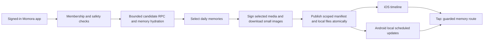

# Momora home-screen widget — implementation plan

**Status:** Implementation complete; production validation pending

**Approved revision (2026-09-16, device feedback):** Only memories with photos or
ready, unreported illustrations are eligible. Exclude text-only, audio-only and
video-only memories before selection. Photo cards fill the container without
a date/caption overlay; Android retains a small top-right m. badge. Failed image
loads use another staged image or a neutral state, never journal-text fallback.
This revision supersedes the original text/poster/fallback presentation options
in the historical planning sections below. See the feature doc for current behavior.

**Date:** 2026-09-09
**Last reviewed:** 2026-09-15 — Astra adversarial findings incorporated
**Scope:** Small square iOS widget and compact tall Android widget
**Feature-doc target:** `docs/features/home-screen-widget.md`

## 1. Outcome and agreed direction

A parent adds a small Momora widget to their phone. It looks like a Looking
Back cover card, shows one saved memory, changes daily, and opens that memory
when tapped. It works with the first memory, including one dated today.

Agreed in discussion:

- iOS: small square (`systemSmall`) only; no medium, large, or extra-large portrait variant.
- Android: compact tall card, with user resizing disabled. Adapt to device grid
  dimensions without offering resize handles.
- Seven-day offline window, refreshed only after successful online validation.
- Android implementation uses official Jetpack Glance through a local Expo module.
- Plan store releases for widget design changes; OTA support is not a requirement.
- Reuse the visual language of Looking Back's Timeline cards.
- Photo/illustration-led, with a small date label; text memories get a warm
  typographic cover.
- Any saved memory date is eligible: no Looking Back archive-age threshold.
- One memory per card; tap opens its detail, without a package intro.
- Daily rotation, subject to the phone's scheduling limits.
- Initial delivery requires new binaries and store submissions on both platforms.

These decisions include the follow-up discussion after the initial plan.
Other implementation details remain recommendations, including cache byte
limits and the exact Android grid footprint. Validate these during the first
implementation milestone.

Out of scope: wallpaper, lock-screen-specific sizes, Live Activities, story
playback inside the widget, next/previous controls, new AI generation, new
subscription products, and modifying Looking Back's package/viewed state.

## 2. What exists in Momora

Paths below are repository-relative and were inspected for this plan.

| Existing source | What to reuse or preserve |
|---|---|
| `src/components/looking-back/package-card.tsx` | Actual Timeline cover: 168×244, 20-point corners, full-cover art, dark lower scrim, Newsreader title, small Jakarta metadata; emotion-tinted quote plate without art |
| `src/components/looking-back/cover-artwork.tsx` | Image versus emotion-paper fallback treatment |
| `src/constants/theme.ts`, `app/_layout.tsx` | Color/emotion tokens and existing Newsreader/Plus Jakarta font assets; app font loading does not automatically load extension fonts |
| `docs/design/looking-back/README.md` | Approved warm-plate reference and visual-review expectations |
| `src/utils/looking-back-frames.ts` | `lookingBackCover`: ready, visible illustration first; ordered photo or stored video poster; never a raw video as an image |
| `src/hooks/useLookingBackPackages.ts` | Safety filtering and independent viewer/rail thresholds; do not mount this hook as the widget's data source |
| `supabase/migrations/20260812120000_looking_back_themed_recipes.sql` | Current package materialization applies `memory_date <= v_date - 90`, package cooldowns, and owner-profile timezone with UTC fallback |
| `src/services/memories.ts` | `fetchMemoriesByIds(familyId, ids)` explicitly scopes by family and hydrates tags/media; hard cap is 40 IDs. Timeline pages are also 40, so the loaded Timeline is not the archive |
| `src/hooks/useMediaUrls.ts`, `src/services/media.ts` | Authenticated signing; current signed URLs expire after about an hour. They cannot be the widget's multi-day image source |
| `src/hooks/useContentSafety.ts`, `src/services/content-safety.ts` | Personal, family-scoped reports/blocks, version-specific illustration reports, session-only reveals |
| `src/hooks/use-auth.tsx`, `src/hooks/use-family.tsx` | Existing logout, account replacement, membership-loss, and persisted-cache cleanup hooks |
| `src/components/app-providers.tsx`, `src/lib/connectivity.ts` | App-wide lifecycle/connectivity integration; sync must not depend on visiting Timeline |
| `src/lib/routes.ts`, `app/(app)/memory/[id]/index.tsx`, `app/(app)/_layout.tsx` | Existing `memoryDetailRoute`, detail screen, and auth/family/onboarding gates |
| `app.json`, `app.config.js`, `eas.json`, `package.json` | Expo 56 / RN 0.85, scheme `momora`, both app IDs `com.memora.app`, no widget dependency yet; EAS channels already exist |

Also preserve [family access rules](../features/family-sharing.md),
[content reporting](../features/content-reporting.md),
[subscription behavior](../features/subscriptions.md), and
[Looking Back](../features/looking-back.md).

Important configuration details:

- The incoming-share extension already uses `group.com.memora.app.shared`.
  Prefer a dedicated `group.com.memora.app.widgets` group, with narrowly scoped
  entitlements; do not overwrite or clear the sharing extension's container.
- `runtimeVersion.policy` is `appVersion`; inspected app version is `1.3.0`.
  A widget-enabled binary must use a new app version/runtime, not only a new
  build number. Confirm the latest release version when implementing.
- Android already disables backup and blocks foreground-service permissions.
  Preserve these settings. No always-running service is needed for a daily card.

## 3. Research and implementation choice

Primary sources checked on 2026-09-09. These establish platform capabilities;
they do not constitute a tested Momora integration.

### iOS

Use SDK-compatible `expo-widgets` with `@expo/ui` as the first implementation
candidate. The SDK 56 documentation describes an isolated synchronous widget
runtime, props/timelines, shared image storage through `widgetsDirectory`, and
native configuration requiring a build. Standard React Native components,
hooks, and app state cannot run inside the widget. Install using Expo's version
resolver and validate the installed API rather than copying latest-SDK samples.
[Expo SDK 56 widget documentation](https://docs.expo.dev/versions/v56.0.0/sdk/widgets/)

Configure only `systemSmall`. Build a separate native cover using passed-in
design values, local image paths, date, and a short text fallback. Validate
custom fonts, image cropping, tap URL, privacy treatment, and shared-file access
in a development build before integrating live family content.

Precompute a timeline; do not depend on a JavaScript timer running while the
app is closed. Apple controls refresh timing and budgets, so midnight is a
requested transition, not a precise service guarantee.
[Apple timeline guidance](https://developer.apple.com/documentation/widgetkit/keeping-a-widget-up-to-date)

Use one whole-card deep link, validated on warm and cold launches.
[Apple widget navigation](https://developer.apple.com/documentation/widgetkit/linking-to-specific-app-scenes-from-your-widget-or-live-activity)

### Android

Agreed approach: a local Expo module with a Kotlin Jetpack Glance widget,
plus a config plugin for the receiver/resources. It reads a small on-device
manifest and images; it does not start the React Native UI to draw the card.
Glance is Android's supported Compose-style widget framework, separate from
ordinary app Compose UI.
[Glance](https://developer.android.com/develop/ui/compose/glance),
[local Expo modules](https://docs.expo.dev/modules/get-started/)

Implement one compact tall card inspired by the Timeline cover's 168:244
proportions, with user resizing disabled (`resizeMode="none"`). Select target
grid dimensions during the prototype; cell proportions differ by launcher, so
do not assume a particular cell count guarantees this aspect ratio. Adapt
cropping and padding to the allocated bounds while retaining the tall design.
Verify that supported launchers do not show resize handles.
[Android layout guidance](https://developer.android.com/develop/ui/views/appwidgets/overview)

Use platform widget update callbacks and a unique, inexact WorkManager job to
select the current local timeline entry. Coalesce updates; no exact alarms,
foreground service, network polling loop, or daily notification. Reconcile on
widget creation, app sync, time/timezone changes, and reboot as supported.
Explicitly test process death, Doze, and force-stop behavior: a stopped app may
not update until reopened.
[Glance state and updates](https://developer.android.com/develop/ui/compose/glance/glance-app-widget),
[Android widget setup](https://developer.android.com/develop/ui/views/appwidgets)

Alternative considered: `react-native-android-widget` has an Expo example and
config plugin. It could reduce Kotlin work, but its RN 0.85/New Architecture,
headless-update, font, and local-image behavior have not been verified here.
The user selected official Android tools; this alternative is not part of the
implementation. Revisit only through a new discussion if Glance has a blocker.
[Maintainer repository](https://github.com/sAleksovski/react-native-android-widget)

### Release boundary

The first widget release is a native change on both platforms. Future data
refreshes need no release. Compatible app-side JavaScript may use OTA, but
native resources, entitlements, providers, and extension changes need builds.
The agreed delivery policy is to use store releases for widget design changes.
Any later OTA capability is optional and requires evidence for the exact version.
[Expo runtime compatibility](https://docs.expo.dev/eas-update/runtime-versions/)

## 4. Product behavior and visual specification

| State | Card |
|---|---|
| Ready illustration/photo | Cover image; subtle lower scrim; small absolute memory date |
| Text-only or unavailable illustration | Existing emotion-paper palette and quote motif; short plain-text excerpt and date |
| Video memory | Stored poster if available; otherwise text plate. No video download/playback |
| Kept audio memory | Caption/text plate; generic “A sound to remember” if empty. No audio copied to widget storage |
| Only one eligible memory | Keep displaying it; no artificial minimum or cooldown blank |
| No saved memory | Warm neutral “Your memories, right here” plate; tap opens app through normal onboarding |
| Disabled/signed out/access unavailable | Neutral Momora plate, without family names, dates, images, or excerpts |
| Offline, valid cached selection | Continue the prepared daily rotation |
| Cached selection expired | “Open Momora to refresh” neutral plate |

Use exact dates such as “Sep 9, 2026” for V1, avoiding stale relative labels.
Image cards do not need the package title, recipe label, memory count, viewed
veil, or “Revisited today.” Text plates may use up to four fitted lines with
an ellipsis; no AI title generation or fetched URL titles. Keep storage/editor
content unchanged. Never add child names from profile metadata to widget copy.

Prototype the iOS square and Android tall crops with synthetic illustration, portrait photo, landscape
photo, long text, emoji, and empty states. Verify native corner masks, date
contrast, text scaling, VoiceOver/TalkBack, and iOS tinted/dark appearances.
Use native accessible text rather than baking the whole card into a bitmap.
Review both adaptations against the actual Timeline card before release.

Settings has one “Home-screen widget” row with platform addition instructions
and a manual “Show another memory” action. The app automatically prepares
eligible images for the authenticated active family; adding the widget itself
still happens through the phone's widget picker. Never prepare a different
account or family, and keep multiple instances mirrored to the same active
family in V1; independent per-instance family selection is deferred.

## 5. Selection contract

Do not call or modify `get_or_create_looking_back_packages`, its daily sentinel,
cooldowns, or view markers. A widget exposure is not a Lookback view.

Recommended new read-only RPC: `get_widget_memory_candidates(p_family_id uuid)`.

- Authenticated caller, exact-family membership, `SECURITY INVOKER`, existing
  RLS; fixed search path and no grants to anonymous callers. Test the underlying
  membership helper's invocation privileges in the local schema.
- Return at most 40 distinct candidate IDs, plus family-local date, timezone,
  and next-day boundary. Match Looking Back's owner-timezone/UTC fallback.
  Resolve timezone through a narrow `get_widget_family_timezone(p_family_id)`
  `SECURITY DEFINER` helper: validate `auth.uid()` and exact-family membership
  inside its body before reading the owner's profile; return only the validated
  timezone, with UTC fallback for missing/invalid values. Fix its search path,
  qualify table references, revoke PUBLIC/anon execution, and grant authenticated
  execution only. The candidate RPC remains `SECURITY INVOKER` for memory reads.
  Do not broaden `user_profiles` RLS: managers/viewers cannot otherwise read
  the owner's timezone. Existing Looking Back uses a definer function for this
  join (`20260812120000_looking_back_themed_recipes.sql`).
- All otherwise valid stored memory dates qualify. No `created_at` age gate,
  no 90-day minimum, no anniversary requirement, no four-memory minimum.
- Sample four bands: under 90 days, 90 days–18 months, 18–36 months, 36+ months.
  Target up to ten candidates per band; backfill missing bands from remaining
  eligible rows. Any imported future date already permitted by the app belongs
  in the first band and displays its absolute date; do not add a new date policy.
- Use stable family/date/ID hashing to vary candidates each day. Bound returned
  rows and hydration; benchmark the database scan/sort separately, since a
  `LIMIT` alone does not bound database work.
- Filter the caller's reported memories and blocked authors before capping
  where practical using existing safety tables and RLS; client filtering remains
  authoritative before publication. Hidden illustrations fall back to text.
- Hydrate through existing `fetchMemoriesByIds` in its 40-ID bound. Avoid
  fetching the entire archive or treating the first Timeline page as all dates.

Client selector prepares seven distinct daily slots (memories may repeat for a small archive). Alternate nonempty age bands,
shuffle deterministically within a band, and avoid duplicate IDs until the
candidate pool is exhausted. Prefer IDs not in the device's last seven scheduled
days, relaxing this preference when needed. This history records scheduled
cards, not proof the user saw them. Keep today's valid card stable during
same-day sync; replace it when deleted/hidden or its source changes. A first
memory can populate an empty widget immediately after save; AI is never awaited.

Before renewing expiry, rehydrate every retained current/future card ID through
RLS, even when absent from the new candidate sample. Use a separate bounded
`fetchMemoriesByIds` call for at most seven distinct retained IDs; keep the fresh
candidate fetch at its existing 40-ID limit. Reapply fresh persisted safety state,
compare `updated_at`, artwork key/generation and media ordering, and remove
missing/inaccessible/reported/blocked cards. Rebuild changed cards and their tap
media index; never republish old art/text after an authoritative change. Failed
replacement-image loading uses the freshly validated text fallback. A failed
retained-row or safety lookup cannot renew the old manifest's expiry; keep only
its still-valid prior lease unless access loss requires immediate clearing.
Publish a renewed manifest only after all entries it includes have passed these
checks. Cached query success alone is not fresh online validation.

No new materialized package tables, AI jobs, public assets, or cron are needed.
Add only the candidate RPC/timezone-helper migration and necessary measured indexes. Regenerate database
types using the repository's local Supabase workflow; do not hand-edit them.

## 6. Data flow, offline limits, and privacy

Proposed manifest fields: schema version, account/family scope, generation ID,
verified-at time, expiry, timezone, and dated entries containing memory ID,
source `updated_at`, optional media index, local image filename, excerpt, date
label, and colors. Never store auth tokens, presigned URLs, full hydrated family
profiles, original audio, or original video in the widget container.

Expiry is exactly 168 elapsed hours after successful online membership, safety,
and included-memory revalidation. Set `verifiedAt` conservatively to the start
of that successful validation pass; failed syncs cannot advance it. Slot one
starts immediately and slots two through seven start at successive family-local
midnights. Keep slot seven visible through any remaining partial day until expiry;
then show neutral. For example, a noon sync on Sep 15 expires at noon Sep 22,
with slot seven covering Sep 21 and the morning of Sep 22. Do not add an eighth
image or expire early. Compute midnight boundaries in the validated timezone,
but compute expiry as elapsed time, so DST cannot lengthen the 168-hour lease.

Initial image targets: at most seven resized images, 512px longest edge, 1 MB per image,
10 MB published cache including metadata. Treat these as prototype targets;
measure decoded memory use as well as file size. Use authenticated media signing
and download only selected art; original-photo fallback must obey size/download
bounds. Failure produces a text plate, not an AI retry or a blocked memory save.

Stage files under a new generation, validate them, then atomically swap the
manifest and request widget updates. Garbage-collect previous files only when
they are no longer referenced. Scope/generation checks must reject late
downloads after sign-out or family changes. Widget rendering never needs a
live signed URL or Supabase session.

Run sync for the authenticated active family on launch/resume/reconnect, family
changes, and relevant successful mutations (save/edit/delete/report/block/
illustration completion). Debounce; never put widget work in the critical
capture path.
Use a singleton coordinator under the existing providers with platform-specific
adapters, not one coordinator per screen. Native modules must be optional/no-op
on unsupported runtimes, web, and older binaries.

On opt-out, sign-out, account change/deletion request, known access loss, or
family switch: invalidate the generation, replace all timelines with a neutral
snapshot, cancel work, delete scoped files, and request reload. Wire both explicit
actions and existing auth/membership observers. On known report/delete, remove
the affected card immediately from current and future entries. Session-only
“Show anyway” must not authorize persistent widget display; use persisted report
state when preparing cards.

Remote deletion/revocation while the app is offline cannot be detected instantly.
The agreed seven-day cache is a maximum authorization age, not a promise of
immediate remote revocation. Do not extend it after failed/offline validation.
Append a neutral expiry timeline entry on iOS; Android renders neutral when the
manifest is expired. The OS can retain an already-rendered snapshot or delay a
refresh, so even that expiry is not a guaranteed pixel-erasure deadline. Test and
document this limit; if strict remote revocation is required, this local-only
design needs revision before shipping.

Exclude widget files from backup and assess file protection/locked-device
behavior. A home-screen size can appear on other system surfaces; audit iPad,
StandBy, and mirrored widgets rather than promising “home screen only.” Evaluate
Apple's privacy/data-protection controls in the prototype.
[Apple platform security guidance](https://help.apple.com/pdf/security/en_US/apple-platform-security-guide.pdf)

Treat this as private archive viewing, not share-card export: no public URL or
watermarked server compositor dependency, and no new paid gate. All current
family roles retain their existing read rights. Adding the widget through the
phone's picker controls exposure.

## 7. Tap routing

Add a small widget entry route, proposed `app/widget.tsx`, with only a validated
memory ID, family ID, and optional media index. Centralize its URL builder in
`src/lib/routes.ts`; never place text, names, image URLs, or credentials in links.

On tap, wait for auth/family initialization; verify current membership and fetch
the target through RLS before opening `memoryDetailRoute`. Resolve legitimate
cross-family navigation deliberately; never substitute a same-looking card
from the active family. For missing/inaccessible/invalid targets, show neutral
feedback and go to the normal Timeline/no-family flow. Signing in as another
account must not replay a previous account's pending target automatically.
Preserve existing auth, onboarding, and billing gates. Verify media index points
to the chosen photo/poster when a multi-asset memory opens.

## 8. Implementation sequence and evidence

### W1 — Bounded native/design prototype

- Use synthetic local assets; an iOS small square and an Android tall, non-resizable
  widget, with fonts, date,
  deep link, image/text states, and a short accelerated test timeline.
- Prove rendering/rotation after the app process exits and while offline;
  explicitly distinguish process death from Android force-stop.
- Confirm Expo 56 APIs, minimum OS compatibility, font embedding, App Group
  signing alongside incoming sharing, native Android approach, and supported
  privacy controls. Keep prebuild reproducible through config plugins/modules.
- Exit evidence: screenshots on real iOS/Android devices, logs without private
  content, measured cache/render bounds, and the tested Android grid footprint.

### W2 — Selection and database contract

- Add bounded read-only RPC, SQL authorization/selection tests and benchmark.
- Add `src/services/widget-memories.ts` and `src/utils/widget-selection.ts` with
  unit/integration coverage. Reuse existing hydration within its current bound.
- Update TECH_SPEC, generate types, preserve all Looking Back behavior/tests.

### W3 — Cache and lifecycle integration

- Add `src/services/widget-cache.ts`, `src/hooks/useMemoryWidgetSync.ts`, and
  `src/widgets/` platform adapters/types; Android module under proposed
  `modules/momora-widget/` and its config plugin under `plugins/`.
- Implement atomic publication, expiry, safety projection, bounded downloads,
  cancellation, and cleanup hooks. Test races before using real family content.
- Replace prototype fixtures with the real manifest on both platforms.

### W4 — Setup, routing, and visual acceptance

- Add the Settings row/setup screen and guarded widget entry route.
- Verify the small cover against Looking Back; preserve safe-area/keyboard
  rules for any new in-app controls. Use synthetic gallery previews.
- Add app E2E and native widget tests; document launcher steps that cannot be
  reliably automated. No simulated screenshot counts as device validation.

### W5 — Release

- Bump app version/runtime; keep stable widget kind/provider identifiers across
  later releases. Generate new iOS/Android builds on existing preview/device
  channels, then test an upgrade from a widget-free binary.
- Confirm new widget entitlements/provisioning coexist with the incoming-share
  extension, and smoke-test incoming photo/video sharing on both platforms.
- Run an actual compatible OTA test and verify old runtimes do not receive
  native-dependent code. Missing native capability must fail quietly.
- Ship via TestFlight/Play testing, then normal store submission after release
  validation. Build/store actions are future work, not performed by this plan.
- Rollback: disable publication/neutralize widgets in a compatible app update;
  native widget removal or repair still needs a new binary. Offline stale OS
  snapshots have the limitations described above.

## 9. Verification checklist

Follow [TESTING.md](../TESTING.md). Proposed test files:

| Layer | File / acceptance |
|---|---|
| Unit | `src/utils/widget-selection.test.ts`: zero/one/many, today's/backdated memories, band backfill, deterministic selection, repeat relaxation, timezone/DST/leap-day boundaries; noon sync spans eight dates with slot seven held until exactly 168 hours; spring/fall DST preserves elapsed expiry |
| Unit | `src/services/widget-cache.test.ts`: image limits, atomic swap, schema mismatch, expiry, missing files, interrupted writes, old-generation rejection |
| Integration | `src/services/widget-memories.integration.test.ts`: family scope, 40-ID cap, hydration failures, safety failures, hidden illustration/version changes, no raw video/audio |
| Integration | `src/hooks/useMemoryWidgetSync.integration.test.tsx`: save remains independent; logout and in-flight download race; account/family switch; partial/total membership loss; report/block; no offline lease renewal; retained IDs absent from fresh candidates are revalidated; remote delete/edit updates or removes them; failed retained fetch cannot renew expiry |
| Integration | `src/screen-tests/widget-entry.integration.test.tsx`: warm/cold target, auth delay, different account, malformed/deleted/forbidden memory, selected media index |
| SQL | `supabase/tests/widget_memory_candidates.sql`: anonymous/nonmember denial, Family A role has no Family B access, role read parity, date bands, cap, uniqueness, timezone, deterministic sampling; owner/manager/viewer agree across a non-UTC midnight; timezone-helper anonymous/nonmember/cross-family denial and no widened profile reads |
| Native | iOS timeline/local-file/navigation tests and Android manifest/receiver/work tests, including expiry after process death and reboot; add commands to repository docs when tooling is chosen |
| E2E | Proposed `.maestro/flows/widgets/open-memory.yaml`: automatic preparation, display, tap expected memory. Add explicit physical launcher setup/refresh evidence where automation is unreliable |

Required final implementation checks: `npm run typecheck`, `npm run lint`,
`npm test`, `npm run test:edge`, and `npm run test:db` against the isolated local
database when the migration lands. Benchmark candidate selection on a synthetic
large archive; report measured performance without inventing a production SLO.

Device matrix: iPhone and Android Pixel/Samsung launcher; supported oldest OS and
current OS where available; dark/tinted modes, large text, offline seven-day
timeline/expiry simulation, low-power/Doze, reboot, app killed/force-stopped,
add/remove/re-add, duplicate widgets, app upgrade, logout, and removed membership.
Use accelerated clocks/synthetic data plus an overnight real-time rotation check.

Create `docs/features/home-screen-widget.md` and index it in
`docs/features/README.md` with the implementation. Document cache lifetime,
refresh limitations, setup, permissions, routing, tests, and extension points;
add a short Looking Back cross-reference explaining that the widget shares
presentation concepts but has separate selection and no package viewed state.

## 10. Remaining validation and limits

1. Verify seven-day rotation and neutral expiry on real devices. The agreed
   window does not guarantee immediate remote revocation or OS snapshot removal.
2. Validate the iOS square crop and Android tall crop, including text readability.
   Choose the Android grid footprint and verify resizing is disabled across
   supported launchers; exact pixel proportions can still vary.
3. Native module compilation and five Android parser tests now pass with Glance
   1.2.0. Full APK and actual launcher acceptance remain release gates.
4. Verify runtime isolation for app-side OTA changes. Widget design changes
   use store builds; no layout OTA capability is required for launch.

Implementation authorized on 2026-09-15 using Luna Max subagents with root
orchestration and adversarial review. Production deployment and store submission
remain separate release actions. Measured verification is recorded in the [readiness report](../testing/home-screen-widget-readiness.md) and feature doc.
