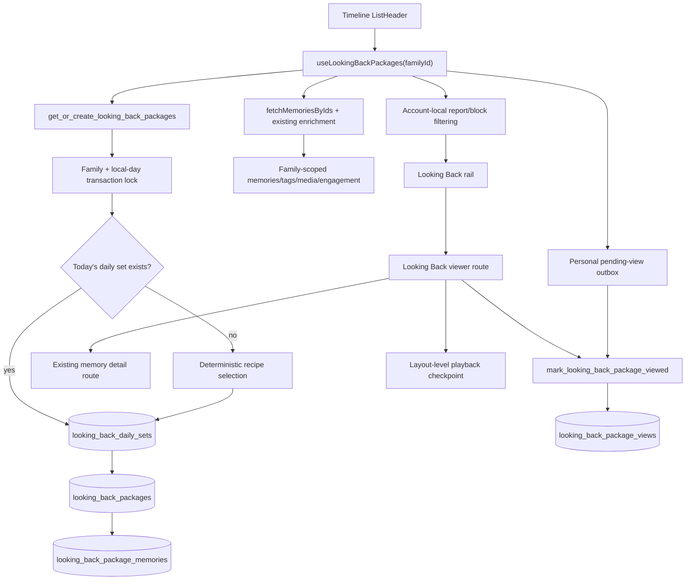

# Looking Back — Feature Specification and Implementation Plan

**Status:** Adversarially reviewed — ready for implementation
**Date:** 2026-08-08
**Owner:** Eduardo + Codex
**Feature-doc target:** `docs/features/looking-back.md`
**PRD areas:** Product Principles 3–7; Journey C — Revisit; §6.5 Memory Organization
**Review:** GPT-5.6-sol adversarial review incorporated 2026-08-08

## 1. Outcome

Looking Back turns Momora's archive into a calm daily rediscovery experience:

1. A horizontal rail of curated memory packages appears directly under the
   Timeline header when the family has a worthwhile set that day.
2. Opening a package launches an immersive, story-like viewer. Each memory is
   one chapter; a multi-asset media memory contributes consecutive frames
   inside that chapter.
3. The viewer auto-advances, supports tap navigation and hold-to-pause, opens
   the existing memory detail screen without losing its place, and ends with a
   quiet completion state.

This is an archive-viewing reward, not a capture prompt. It must not use
streaks, urgency, expiry language, unread rings, guilt, or a request to create
something in return.

## 2. Design source of truth (non-negotiable)

The implementation must reproduce the approved Claude Design handoff, not
reinterpret it from prose or build a generic Stories UI.

Current source artifact:

- Local path: `/Users/eduardoyi/Downloads/Momora screens-handoff (1).zip`
- SHA-256: `7866b61a9f1860db9329b86cb4b29bd303cd1ce9db48c973f85b48c196b1487c`
- Primary design file: `momora-screens/project/Momora screens.html`
- Required sections: **Looking back · packages on the Timeline** and
  **Looking back · the package viewer**
- Required behavior notes: `src/screens/rediscover-proto.jsx`
- Resolved rail: `src/screens/rediscover-rail.jsx`, warm-plate variant
- Resolved viewer: `src/screens/story-viewer.jsx`
- Package/frame fixtures and dwell rules: `src/rediscover.jsx`
- Shared visual language: `colors_and_type.css`, `src/tokens.jsx`,
  `src/primitives.jsx`, and the existing Timeline/memory-detail sources

Before implementation begins, preserve this exact zip in the repository at:

`docs/design/looking-back/Momora-screens-handoff.zip`

Add `docs/design/looking-back/README.md` beside it with the original filename,
checksum, export date, selected artboards, and a note that the prototype is a
visual/interaction specification rather than production React Native code.
Keeping the artifact in the repository makes design review reproducible for
future agents, CI worktrees, and PR reviewers; a file in one developer's
Downloads folder is not a durable project dependency.

Design precedence for implementation questions:

1. This plan's product, security, data, accessibility, and native-platform
   rules.
2. The Claude handoff's resolved visuals and interaction/motion notes.
3. Existing Momora production components and tokens where they do not conflict
   with the approved handoff.

Native implementation may not copy the prototype's internal HTML structure.
It must translate the output to Expo/React Native while matching its visual
result. Any intentional visual deviation must be listed in the PR with before
and after screenshots and approved by Eduardo.

## 3. Locked product decisions

| Decision | Resolution |
|---|---|
| Daily inventory | Up to **4** packages per active family; show fewer when cooldown or eligibility leaves fewer good candidates |
| Package size | **4–10 distinct memories** |
| Multi-asset counting | A media memory with 1–10 assets counts as one memory/chapter; each asset becomes a frame |
| Selection | Deterministic V1; no LLM, embeddings, generated summaries, or semantic analysis |
| Rotation | One family-level set per local day, stable for that whole day |
| Cooldowns and variety | Exact final package 14 days; any included memory 7 days; recently exposed recipe identities receive a 3-day ranking penalty, not a hard exclusion. Each daily set contains at most one package per recipe type; age packages softly prefer a subject not featured by that recipe in the preceding three days. |
| Same-day overlap | One memory may appear in at most one package that day |
| General archive age | At least 90 days old |
| Anniversary age | At least one calendar year old |
| Viewed state | Personal to the account; set after the first real memory frame becomes visible |
| Long text | Fitted excerpt with the approved fade; full text is available through **Open memory** |
| Long video | Start at 0, muted; play at most 9 seconds; hold the final frame until a 3.5-second minimum |
| Subscription | Archive viewing remains available to owners/managers/viewers and lapsed owners |
| Empty state | If no visible package still contains at least four memories, omit the entire rail with no placeholder |

## 4. User-facing specification

### 4.1 Timeline rail

- Place **Looking back** directly under the existing Timeline header and above
  the current **This week**/recent memories content.
- The rail is part of the Timeline's scrollable `FlatList` header; it is not
  sticky.
- Render the resolved Claude **warm plate** cover direction. The alternative
  print-stack/contact-sheet directions remain reference explorations, not
  implementation choices.
- Horizontal interaction uses native momentum with snap-to-card-start. Do not
  show arrows, pagination dots, a horizontal scrollbar, or an unread ring.
- A package card shows its kind, title, and either
  `{visible memory count} memories · {era}` or the account-specific viewed
  label such as `Revisited today`.
- Unviewed/viewed color, scrim, shadow, saturation, and lavender veil follow
  `rediscover-rail.jsx` exactly. Viewed cards stay in their original order.
- Press feedback changes opacity only (`0.9`, 140ms); it does not scale.
- Text-only packages use the approved emotion-tinted typographic plate with a
  single quotation glyph and no extracted memory quote.
- A cover chooses, in order: a non-hidden ready illustration, a non-hidden
  media preview/poster, then the text-only plate. A hidden/reported
  illustration falls back without hiding the underlying written memory.
- Package loading never blocks capture or Timeline refresh. During the normal
  cold Timeline load, fetch packages in parallel. If Timeline data wins, show
  the Timeline without a rail; a later successful package result may fade the
  rail in without a skeleton. Package errors are silent and do not replace the
  Timeline with an error state.

### 4.2 Opening and closing

- Opening follows the handoff's 380ms cover-to-viewer expansion and warm-mat
  fade. The Timeline remains mounted underneath.
- The viewer begins on the approved title card and waits for an explicit
  **Start** button styled like the completion screen's primary action. Start
  enters the first memory frame unpaused. The intro does not auto-advance and
  does not expose the memory-frame tap/hold instruction.
- A persistent close control sits in the top-right safe area. Android hardware
  Back and iOS navigation Back close the viewer as well.
- Closing reverses the transition to the originating card when its layout is
  still available; use the handoff's fade fallback when it is not (deep link,
  rotation, card scrolled/recycled, or changed daily set).
- Mark the package viewed when the first actual memory frame becomes visible.
  Opening and immediately closing the intro does not mark it viewed.

### 4.3 Viewer chapter/frame model

- One memory is one chapter.
- `text_illustration` with a ready, non-hidden illustration: one illustration
  frame.
- `text_illustration` whose illustration is absent, pending, failed, or hidden:
  one text frame; rediscovery never exposes retry/regenerate controls.
- `text_only`: one text frame.
- `media`: one frame per ordered `memory_media` row. There is no production
  `multi_media` memory type; that handoff label maps to existing `media` rows
  with multiple assets.
- Media frames remain consecutive. Date, caption, emotion, member identity,
  and chapter marker remain visually stable while assets change.
- Within a chapter, assets cross-fade over 300ms. Between chapters, content
  cross-fades over 300ms while the dark mat's emotion glow transitions over
  380ms. Do not substitute horizontal slide/push animations.
- Tagged-member avatars use the existing date-aware portrait selection for
  the memory date. One tagged child may show name and age-at-memory; multiple
  members show faces only, matching the handoff.
- The only frame action is **Open memory**. Likes, comments, sharing, edit,
  regenerate, report, and other management controls remain in memory detail.

### 4.4 Progress and dwell

The progress system follows the handoff, with the equal-width product override
approved during device testing on 2026-08-08:

- One segment per memory/chapter.
- Every slide/frame receives the same visual width even when dwell time differs.
- A multi-asset chapter remains visually grouped with hairline gaps.
- Fill animation is linear and does not pulse or bounce.

Durations:

| Frame | Dwell |
|---|---:|
| Package intro | Waits for explicit **Start**; no timer |
| Ready illustration | 5,600ms |
| Photo | 4,600ms, starting only after ready |
| Video | `clamp(actual duration, 3,500ms, 9,000ms)` |
| Short text (≤45 words) | 5,600ms |
| Long text (>45 words) | `min(16,000ms, 6,000ms + words × 260ms)` |

- A video longer than nine seconds plays its first nine seconds, then advances.
- A video shorter than 3.5 seconds holds its final rendered frame until the
  tick completes.
- Unknown video duration falls back to 6 seconds and corrects once authoritative
  duration/player state becomes available.
- Photo/video progress does not start while the asset is loading or while a
  video is buffering.
- Photos prefer their derived preview, retry transient signed URL/image
  failures twice, and fall back to the original before becoming unavailable.
  Video frames show the stored first-frame poster (or a runtime thumbnail for
  legacy rows) with a video/loading treatment until the first frame renders.
- Failed/unavailable media uses the normal photo dwell once the unavailable
  state is known, so the package does not stall permanently.

### 4.5 Navigation and pause rules

- Tap the left third for the previous frame and the right two-thirds for the
  next frame.
- A 220ms press-and-hold pauses at the current progress. Release resumes from
  the same progress.
- Buttons and links win the gesture arena and never trigger frame navigation.
- The approved pause veil and pill appear while held. Media captions expand
  while paused as shown in the handoff.
- App background, incoming interruption, route blur, media buffering, opening
  memory detail, and a screen-reader session pause automatic progress.
- Before opening detail, serialize a playback checkpoint into the app-layout
  Looking Back context: package/daily-set identity, chapter and asset indices,
  elapsed fraction, phase, mute state, and pause reason. Pass the current media
  index to detail as today. On viewer focus, restore from that checkpoint before
  resuming. This must work even when native-stack detaches, freezes, or remounts
  the route; mounted-screen retention is not an architectural assumption.
- Do not auto-open the next package after completion.

### 4.6 Long text

- Use the handoff's long-text cream page, emotion tint, quotation glyph, fade,
  and calculated dwell.
- Render only the excerpt that fits the safe viewport. Do not shrink text below
  the approved accessible size and do not introduce an internal scrolling
  region or automatic text pagination in V1.
- The fade and **Open memory** communicate that the complete entry remains
  available. Screen readers receive the complete memory text, not only the
  visually clipped excerpt, and automatic advancement is disabled for them.

### 4.7 Loading, unavailable, and offline

- Loading follows the approved cream-8% panel and gentle 1.6s pulse. The
  timer is stopped until the media is ready.
- Replace the prototype's storage-inaccurate headline with
  `This photo isn't available right now.` The supporting message remains calm
  and must not claim Supabase/R2 content is syncing to the device.
- Keep the memory date/caption/member context when media is unavailable.
- When offline, display the last successfully cached package set for the active
  family and use any media already in the `expo-image` disk cache. Do not invent
  a new day's packages locally.
- If the calendar boundary passes while a viewer is open, freeze that viewer's
  daily set until it closes. Refresh the Timeline rail afterward; never replace
  chapters during playback.
- The existing global offline banner remains visible above the viewer; all
  viewer controls must stay below the effective top inset/banner area.

### 4.8 Completion

- After the last frame, show the approved fanned package artwork, completion
  sentence, and reassurance that the memories remain in the Timeline.
- Actions are only **Back to your timeline** and **Play it again**.
- Replay resets to the first real frame and does not re-show the title intro.
- No share prompt, next-package autoplay, capture CTA, paywall, or notification
  prompt appears here.

## 5. Package recipes and selection

### 5.1 V1 recipe vocabulary

Use a closed `package_type` vocabulary shared by SQL, TypeScript, analytics,
and documentation:

| Type | Candidate definition | Template direction |
|---|---|---|
| `on_this_day` | One candidate per prior year containing 4–10 memories on that exact month/day; at least one year old | `On this day` / `Two years ago today` |
| `one_year_ago` | Memories in the seven-day window centered on the date one year ago | `A year ago` / `This week, one year ago` |
| `around_this_time` | Memories within ±7 calendar days across prior years, leap-day safe | `Around this time` / templated year range |
| `member_at_age` | Memories tagging one member while their age-at-memory is the same integer age from 0–17 | `[Name] at [age]` for ages 1–17 / `From [Name]'s first year` at age 0 |
| `month_archive` | 4–10 memories from one past calendar month/year | `From your archive` / `From August 2025` |
| `written_archive` | Text-only memories older than 90 days | `From your archive` / `Small things, written down` |
| `archive_mix` | Deterministically seeded, age-balanced selection across eligible older memories; up to 4 newer historical, 3 medium, and 3 deep-archive memories before backfill | `From your archive` / `A little look back` |

V1 deliberately excludes semantic packages such as `Quiet mornings`, `The
summer of the hose`, locations, milestones, or "best" memories. Momora does
not store time-of-day/location/milestone metadata, and inferring those titles
would violate the no-AI decision. A future version may add a separately
reviewed semantic recipe without changing package storage.

Seasons are represented by neutral date ranges/months in V1; do not label a
June–August package `Summer` without family locale/hemisphere data.

### 5.2 Eligibility

- Query only the requested active family.
- `archive_mix`, `written_archive`, `month_archive`, and `member_at_age`
  exclude memories newer than 90 days.
- Anniversary recipes require dates from a prior calendar year.
- Illustrated memories remain eligible when generation is pending/failed;
  they present as text and cannot be chosen as a visual cover until ready.
- Media rows remain eligible when their DB asset exists even if the bytes are
  temporarily unavailable at playback time.
- A package must have 4–10 distinct memory IDs after recipe construction.
- Candidate construction never reads likes/comments as a proxy for emotional
  importance and never reads memory content to generate a title.
- Age recipes require a tagged member with DOB and age 0–17 at `memory_date`;
  no new relationship-label/profile-type column is introduced.

### 5.3 Determinism, scoring, and cooldown

For a family-local day:

1. Under the family/day lock, return the existing daily-set row and its package
   rows if one exists. The daily-set row is the materialization sentinel, so an
   intentionally empty day is stable too.
2. Generate all eligible candidates using only database metadata. Give each a
   non-PII `recipe_identity` made from its type plus subject/window identity.
3. Remove memory IDs exposed by any package in the previous 7 days. For
   `archive_mix`, classify survivors as newer historical (90 days–18 months),
   medium (18–36 months), or deep archive (36+ months), choose up to 4/3/3
   candidates per band using a stable daily hash, then append deterministic
   backfill candidates until the archive has at most ten IDs. Normalize
   thematic recipes in `(memory_date desc, created_at desc, id)` order, while
   preserving the mixed archive's quota-first candidate order. Discard
   candidates below four memories.
4. Within each recipe type, rank candidates by deterministic daily key after
   applying a 3-day penalty to a recently exposed `recipe_identity`. For
   `member_at_age`, first apply a soft 3-day penalty to candidates whose
   subject was recently exposed by another age package. Keep only the best
   candidate per recipe type, then rank those candidates by recipe priority
   (`on_this_day`, `one_year_ago`, `member_at_age`, `around_this_time`,
   `archive_mix`, `month_archive`, `written_archive`). When a viable
   `archive_mix` exists, no more than three higher-priority thematic packages
   may consume the set before it is considered. This reserves one daily slot
   for broad rediscovery without requiring households to have multiple
   children or recipe types. If the mixed candidate fails after de-overlap or
   exact-signature cooldown, lower fallbacks may fill the released slot.
5. Greedily consider candidates until four are selected or candidates run out.
   Remove IDs already selected that day and discard candidates below four;
   `archive_mix` re-ranks remaining IDs within each age band so overlap
   refills the 4/3/3 quotas before deterministic cross-band backfill.
6. Only now compute the final `signature = sha256(package_type +
   recipe_identity + sorted final memory ids)`. Reject it if that exact final
   signature appeared in the previous 14 days; continue to the next candidate.
   Never put names or content in either identity.
7. Insert the daily-set sentinel and selected packages/items transactionally.
   Repeated requests return the same set and order, including an empty set.

Cooldown is based on exposure in the daily rail, not whether someone opened
the package. This guarantees that ignoring a package does not cause it to be
shown repeatedly.

The 14-day exact-package and 7-day memory cooldowns are hard. Recipe-identity
and age-subject penalties are deliberately soft: hard-excluding an entire
type or subject for three days would exhaust small archives. The one-per-type
rule applies only within a daily set. If hard cooldowns yield no candidate,
show no rail rather than repeat a package.

## 6. Access, privacy, safety, and billing

- Packages are family-owned. All package/package-item SELECT policies use
  `is_family_member(family_id)`; no package table uses `auth.uid() = user_id`
  as its tenancy rule.
- Materialization is a `security definer` RPC that validates `auth.uid()`,
  checks membership in the exact `family_id`, sets a safe `search_path`, and
  takes a family/day advisory transaction lock before reading or writing.
- Package and item tables have no authenticated INSERT/UPDATE/DELETE grants.
- Viewed rows are account-specific. The view RPC may only write the caller's
  `(package_id, auth.uid())` row after confirming the package belongs to an
  active family membership.
- Never log memory content, package titles containing member names, family
  names, media keys/URLs, DOBs, or raw package membership.
- The package-selection signature contains only type/window identifiers and
  UUIDs and must not be sent to analytics.
- The client applies `useContentSafety()` before rendering packages:
  - an open memory report omits that memory unless the user explicitly revealed
    it in the current content-safety state;
  - a blocked creator omits their memories unless revealed;
  - a reported illustration falls back to the written-memory presentation;
  - a reported member profile/portrait prevents its face/name from appearing;
  - after filtering, hide packages with fewer than four visible memories.
- Content-safety filtering also recalculates the visible count and cover; never
  retain a hidden memory's cover after removing its chapter.
- Looking Back is read-only archive access and remains available regardless of
  `has_write_access`, including viewer roles and lapsed owners. It never calls a
  paid-mutation entitlement guard.
- Switching active families changes the query key and cannot flash the prior
  family's packages or viewer state. An open viewer validates its stored
  `family_id` against the active family and current membership on focus; it
  closes to the correct Timeline if they differ or access was removed.

## 7. Accessibility requirements

- Every package card is one accessible button with a meaningful label that
  includes kind, title, visible memory count, era, and revisited state without
  repeating decorative imagery.
- Progress bars expose chapter/frame position semantically but are not
  separately focusable.
- Close, mute, Open memory, Back to timeline, Replay, Previous, and Next have
  labels, roles, and minimum 44×44pt hit areas even when their visible chrome is
  smaller.
- When VoiceOver/TalkBack is active:
  - disable automatic advancement;
  - expose explicit Previous/Next actions and adjustable progress semantics;
  - provide the complete text to accessibility APIs;
  - do not use left/right tap zones as the only navigation path.
- Honor Reduce Motion: replace cover expansion and glow/scale movement with
  opacity transitions while preserving duration/state semantics.
- Pause on app background, route blur, screen-reader activation, and media
  buffering.
- Support Dynamic Type without placing controls outside safe areas. For the
  immersive composition, cap purely decorative/package-cover typography where
  necessary, but never truncate control labels or the accessible full text.
- Verify iOS and Android, including a non-zero Android bottom navigation inset.

## 8. Architecture



No new npm dependency, Edge Function, AI call, Workflow, R2 object, cron job,
or notification is required.

## 9. Data model

Names are provisional but should remain domain-specific rather than generic
`collections` names.

### 9.1 `looking_back_daily_sets`

This parent row records that a family-local day was materialized even when it
produced zero packages. Without it, repeated calls on an empty day could select
different results as memories change and violate the whole-day stability rule.

| Column | Shape | Notes |
|---|---|---|
| `id` | `uuid primary key` | Server generated |
| `family_id` | `uuid not null` | FK `families on delete cascade` |
| `package_date` | `date not null` | Owner-timezone local day |
| `timezone_name` | `text not null` | Validated IANA timezone snapshot |
| `refresh_after` | `timestamptz not null` | Next midnight in the snapshot timezone |
| `created_at` | `timestamptz not null` | Default `now()` |

Constraints/indexes:

- unique `(family_id, package_date, refresh_after)` so a backwards timezone
  move can create a new immutable active interval for a previously displayed
  local date without mutating its expired historical row;
- unique `(id, family_id, package_date)` for composite child binding;
- index `(family_id, package_date desc)`.

Once created, its timezone and `refresh_after` are immutable. An owner timezone
change applies when the next set is created; it does not move an existing day's
boundary. Active lookup is by the immutable `[created_at, refresh_after)`
interval, not just by `package_date`.

### 9.2 `looking_back_packages`

| Column | Shape | Notes |
|---|---|---|
| `id` | `uuid primary key` | Server generated |
| `daily_set_id` | `uuid not null` | Daily-set FK, cascade |
| `family_id` | `uuid not null` | FK `families on delete cascade` |
| `package_date` | `date not null` | Owner-timezone local day |
| `package_type` | constrained `text` | Closed V1 recipe vocabulary |
| `subject_family_member_id` | nullable `uuid` | Only `member_at_age`; same-family validation |
| `display_kind` | `text not null` | Templated, private UI copy |
| `display_title` | `text not null` | May include member name; never log/track |
| `display_subtitle` | nullable `text` | Intro copy |
| `display_era` | `text not null` | Rail/completion copy |
| `tint` | nullable constrained `text` | Existing emotion vocabulary/fallback |
| `recipe_identity` | `text not null` | Type + subject/window identity, no content/names |
| `signature` | `text not null` | SHA-256 of final item set, no content/names |
| `position` | `smallint not null` | Check 0–3 |
| `created_at` | `timestamptz not null` | Default `now()` |

Constraints/indexes:

- composite FK `(daily_set_id, family_id, package_date)` → daily sets;
- unique `(daily_set_id, position)`;
- unique `(daily_set_id, signature)`; the final-signature cooldown query is
  the cross-interval boundary, so an immutable interval created by a backward
  owner-timezone move can safely reuse the same displayed local date;
- unique `(id, family_id)` for composite child-table binding;
- index `(family_id, recipe_identity, package_date desc)`;
- index `(family_id, signature, package_date desc)`.

`subject_family_member_id`, when present, uses a same-family composite FK to
`family_members`; it is not enforced by an application-only check.

### 9.3 `looking_back_package_memories`

| Column | Shape | Notes |
|---|---|---|
| `package_id` | `uuid not null` | Package FK, cascade |
| `family_id` | `uuid not null` | Composite-bound to package and memory |
| `memory_id` | `uuid not null` | Memory FK; deleting memory removes item |
| `position` | `smallint not null` | Check 0–9 |
| `created_at` | `timestamptz not null` | Default `now()` |

Use composite FKs so a definer bug cannot attach a Family B memory to a
Family A package. Add a unique `(id, family_id)` constraint to `memories` if
needed for the composite reference. Constraints:

- primary key `(package_id, memory_id)`;
- unique `(package_id, position)`;
- composite FK `(package_id, family_id)` → packages;
- composite FK `(memory_id, family_id)` → memories;
- index `(family_id, memory_id, created_at desc)` for memory cooldown checks.

### 9.4 `looking_back_package_views`

| Column | Shape | Notes |
|---|---|---|
| `package_id` | `uuid not null` | Package FK, cascade |
| `user_id` | `uuid not null` | Auth user FK, cascade |
| `first_viewed_at` | `timestamptz not null` | First real frame |
| `last_viewed_at` | `timestamptz not null` | Replay/latest open |
| `completed_at` | nullable `timestamptz` | First completion |

Primary key `(package_id, user_id)`. SELECT is caller-own plus current family
membership. Writes go only through the idempotent view RPC.

### 9.5 Retention

Keep daily sets/packages/items/views for 45 days, enough for all cooldowns and
troubleshooting. `get_or_create_looking_back_packages` opportunistically
deletes daily sets older than 45 days for the requested family inside the
locked transaction; cascades remove their children. No cron is added.
Memory/family/account deletion cascades remain authoritative.

## 10. Database/API contracts

### 10.1 `get_or_create_looking_back_packages`

```text
get_or_create_looking_back_packages(p_family_id uuid)
returns table (
  daily_set_id uuid,
  package_id uuid, -- nullable only for the one empty-set sentinel row
  package_date date,
  package_type text, -- nullable with package_id
  subject_family_member_id uuid,
  display_kind text,
  display_title text,
  display_subtitle text,
  display_era text,
  tint text,
  position smallint,
  memory_ids uuid[], -- empty with package_id null
  first_viewed_at timestamptz,
  last_viewed_at timestamptz,
  completed_at timestamptz,
  refresh_after timestamptz
)
```

Behavior:

- Authenticated only; exact-family membership check inside function body.
- Resolve the family owner and their valid IANA timezone from
  `user_profiles.timezone`, falling back to UTC only for malformed legacy
  values. Snapshot that timezone on daily-set creation.
- First return any daily set whose immutable `[created_at, refresh_after)`
  interval contains server `now()`. Only after that interval ends does a
  changed owner timezone participate in calculating the next set.
- Derive `package_date` and its absolute next-midnight `refresh_after`
  server-side. DST tests use the timezone snapshot rather than adding 24 hours.
- Take an advisory transaction lock scoped to family/date.
- Return an existing daily set when present; otherwise materialize exactly once
  using §5. A zero-package set is a successful, stable result, not an error;
  return one sentinel row containing daily-set/date/refresh metadata with null
  package fields and an empty `memory_ids`, which the service maps to `[]`.
- Return the current caller's view timestamps without exposing another
  account's viewing behavior.
- Never return memory content or storage keys; those remain behind ordinary
  RLS-aware client queries.
- Genuine authorization errors remain distinguishable. Unexpected execution
  errors are mapped by the client to a silent no-rail result and never block
  Timeline rendering.

### 10.2 `mark_looking_back_package_viewed`

```text
mark_looking_back_package_viewed(
  p_package_id uuid,
  p_completed boolean default false
)
returns looking_back_package_views
```

- Authenticated only; verify active membership in the package's exact family.
- Upsert only `(p_package_id, auth.uid())`.
- Preserve the earliest `first_viewed_at` and `completed_at`; always advance
  `last_viewed_at` on a real-frame open/replay.
- Completion calls may set `completed_at` but cannot clear it.
- Repeated calls are idempotent and safe across concurrent devices.

Add both RPC contracts and all four tables to `docs/TECH_SPEC.md`. Regenerate
`src/types/database.ts`; never hand-edit it.

## 11. Client contracts

### 11.1 Types and services

Add `src/services/looking-back.ts` with:

- closed `LookingBackPackageType` const vocabulary;
- DTOs for package metadata, chapters, frames, view state, and refresh time;
- `fetchLookingBackPackages(familyId)` calling the materialization RPC;
- `markLookingBackPackageViewed(packageId, completed)`;
- error mapping that distinguishes authorization from availability but never
  surfaces a package error over the Timeline.

Add `fetchMemoriesByIds(familyId, memoryIds)` to `src/services/memories.ts`:

- validate a bounded maximum of 40 IDs (4 packages × 10 memories);
- select by both `family_id` and `.in('id', ids)` under the caller JWT/RLS;
- reuse the existing batched tags/media/engagement enrichment;
- return the RPC order at assembly time rather than trusting DB row order;
- omit missing/deleted/unauthorized rows without failing the whole set.

### 11.2 Query and cache

- Add `lookingBackQueryKeyBase` and
  `lookingBackQueryKey(userId, familyId)` to `src/hooks/queryKeys.ts`. Include
  `userId` because viewed state and content-safety visibility are personal.
- Add `useLookingBackPackages()` in `src/hooks/useLookingBackPackages.ts`.
- The query function fetches package metadata and referenced memories and
  assembles raw chapters. The hook then derives account-local visibility with
  `useContentSafety()` in a memoized render-layer selector; do not call a hook
  from a query function. Recalculate covers/counts after that selector.
- Add the query base to the persisted-query allow-list. Keep only the four
  package DTOs and their bounded 40 enriched memories, so Android's one-row
  AsyncStorage limit remains comfortably below the existing timeline cache.
- Query response includes `refresh_after`; invalidate/refetch once after that
  instant while foregrounded, and re-check on app foreground/reconnect.
- Active-family switch and sign-out use existing cache purge/query-key
  boundaries.
- Mark viewed optimistically at the first real frame, but do not make the query
  cache the only source of pending truth. Add a small, feature-specific
  AsyncStorage outbox keyed by user and family with `package_id`, earliest
  pending viewed time, latest viewed time, and pending completion time.
- Every Looking Back query result merges the local outbox over server view
  timestamps before it can replace cached UI state. Flush entries through the
  idempotent RPC on reconnect, app foreground, package open/completion, and a
  successful package fetch; remove an entry only after acknowledgement.
- Extend the existing sign-out, account purge, and active-family-loss paths to
  clear the relevant outbox namespace. This is deliberately not a general
  mutation queue and requires no new package.
- Pull-to-refresh refreshes packages as well as memories, but the server
  returns the same daily materialization.
- Memory update/delete success paths invalidate the Looking Back query for that
  family. A current viewer skips a deleted frame/chapter and continues its
  frozen daily set; if no frames remain it closes. Dropping below four affects
  the rail on return, not an already-open viewer. A same-day memory create does
  not alter the materialized set.

### 11.3 Routes and transition state

- Add `lookingBackPackageRoute(packageId)` to `src/lib/routes.ts`.
- Add `app/(app)/looking-back/[id].tsx` to the app Stack.
- Keep the Timeline/tab navigator mounted under the route.
- Add a narrow app-layout Looking Back session context keyed by
  `(familyId, dailySetId, packageId)`. It stores ephemeral source-card geometry
  plus the serialized playback checkpoint defined in §4.5; it does not persist
  journal content and does not put playback data in route params.
- The viewer owns live playback while focused and checkpoints immediately
  before pushing detail and whenever it blurs. On focus, rebuild Reanimated and
  video state from the checkpoint before resuming. Clear the checkpoint on
  close, completion exit, family mismatch, membership loss, or package loss.
- Treat native-stack mount retention as an optimization only. Add an
  integration/device test that forces a viewer remount during the detail round
  trip and still restores the exact frame/fraction/mute/pause state.
- If source geometry is unavailable, open/close with the approved reduced
  fade fallback.

### 11.4 Components and utilities

Proposed files:

| File | Responsibility |
|---|---|
| `src/components/looking-back/package-rail.tsx` | Rail label, horizontal list, edge spacing, absent state |
| `src/components/looking-back/package-card.tsx` | Resolved warm-plate/text cover and viewed state |
| `src/components/looking-back/story-progress.tsx` | Equal-width frame segments grouped by chapter |
| `src/components/looking-back/story-frame.tsx` | Illustration/photo/video/text/loading/unavailable surfaces |
| `src/components/looking-back/story-footer.tsx` | Date, emotion, caption, portraits, Open memory |
| `src/components/looking-back/story-intro.tsx` | Package title card |
| `src/components/looking-back/story-complete.tsx` | Completion/replay actions |
| `src/hooks/useLookingBackPlayback.ts` | Pure state machine integration, timer/gesture/app-state control |
| `src/utils/looking-back-frames.ts` | Chapter flattening, duration, progress grouping, cover fallback |

Reuse:

- `expo-image`, `expo-video`, `expo-linear-gradient`, `expo-haptics`;
- `react-native-gesture-handler` and `react-native-reanimated`;
- `useMediaUrls`/`mediaImageSource` for private signed URLs and stable cache
  keys;
- current date-aware family portrait helpers;
- current emotion palette and Momora font tokens.

Do not embed `MemoryCard`, the whole memory-detail screen, or
`FullScreenMediaViewer` inside the story. Reuse their data/media helpers while
building the approved story-specific composition.

Only the active video owns an `expo-video` player. Prefetch the current and
next image/poster; do not mount/download every package frame eagerly. Stop and
release players when leaving a frame or viewer.

## 12. Analytics

Add only events tied to explicit product questions:

| Event | Properties |
|---|---|
| `looking_back_package_opened` | `package_type`, `memory_count`, `was_revisited` |
| `looking_back_package_completed` | `package_type`, `memory_count`, `frame_count` |
| `looking_back_memory_opened` | `package_type`, `memory_type` |
| `looking_back_package_replayed` | `package_type`, `memory_count` |

Use closed enums/scalars in `AnalyticsEventMap`. Never send package IDs,
titles, subject/member names, memory IDs/content, dates, emotions, media URLs,
or signatures. Update `docs/features/analytics.md` and analytics tests in the
same workstream.

## 13. Implementation workstreams

Workstreams are ordered. Each workstream includes its tests; do not defer all
tests to the end.

### W0 — Preserve and inventory the approved design

1. Copy the exact handoff zip to `docs/design/looking-back/` and verify its
   SHA-256.
2. Add the design README described in §2.
3. Record the required artboard IDs: `lb-live`, `lb-timeline`, `lb-cover-c`,
   `lb-states`, `lb-cover-text`, `lb-absent`, `lb-notes`, and every `v-*`
   viewer artboard.
4. Create a visual acceptance checklist mapping each artboard to a native
   screen/test state.
5. Do not alter the handoff archive; any product-required deviations live in
   this plan/feature doc.

### W1 — Schema, RLS, and DB contracts

1. Add one migration for the four tables, constraints, indexes, RLS,
   privileges, triggers/composite integrity, and the two RPCs.
2. Implement family/day locking, owner-timezone local date, 45-day cleanup,
   deterministic recipes, greedy de-overlap, and cooldowns.
3. Ensure package tables have read-only authenticated access and no anonymous
   access; view writes only through the definer RPC.
4. Add DB tests for:
   - exact-family authorization and cross-family denial;
   - stable repeated calls, including a materialized empty day, and
     concurrent/unique-constraint behavior;
   - owner-timezone snapshot/date/`refresh_after`, DST boundaries, and an owner
     timezone change after a daily set exists;
   - min 4/max 10 memories and max 4 packages;
   - no same-day memory overlap;
   - final-signature 14-day and memory 7-day hard cooldowns, signature
     recomputation after every trim, and the 3-day recipe ranking penalty;
   - at most one package per recipe type in a daily set and soft rotation away
     from a recently featured `member_at_age` subject when another qualifies;
   - consecutive days with enough candidates do not starve solely because all
     seven recipe types were recently used;
   - each recipe and deterministic archive fallback;
   - leap day/age boundaries;
   - deleted memory/family/account cascades;
   - idempotent account-own viewed/completed writes;
   - direct authenticated writes rejected.
5. Regenerate `src/types/database.ts` from local Supabase.
6. Update TECH_SPEC schema/RPC/RLS sections.

### W2 — Service, query, safety, offline persistence

1. Add the query keys, service DTOs, batch memory fetch, and hook.
2. Assemble RPC-ordered packages and derive cover fallback from visible data.
3. Apply content-report/block/reveal filtering and the post-filter four-memory
   rule.
4. Persist the bounded query; extend purge/persistence tests and verify payload
   size on a worst-case 4×10 package fixture.
5. Implement `refresh_after`, foreground/reconnect refresh, pull-to-refresh,
   and silent failure behavior.
6. Implement the personal pending-view outbox, server/local merge, idempotent
   flush, and acknowledged-entry removal.
7. Add unit/integration coverage for authorization errors, partial deletions,
   active-family switching/removal, offline restore followed by server refetch,
   pending completion reconciliation, outbox purge, stale daily set,
   block/report fallback, and fewer-than-four hiding.

### W3 — Timeline rail with design parity

1. Add package rail/card components using the exact resolved warm-plate design
   and text-only/viewed variants.
2. Refactor the existing `TimelineHeader` at its current composition seam so
   the title/header portion, then Looking Back rail, then existing `StreakDots`
   (`This week`) render in that order. Preserve today's exact spacing when the
   rail is absent, plus current pagination, pending-upload banner, active video
   selection, pull-to-refresh, and scroll-position reconciliation.
3. Add snap behavior, edge spacers, accessibility, and source-card geometry
   capture.
4. Ensure no-package/error/loading states collapse spacing exactly as the
   handoff specifies.
5. Add component and Timeline integration tests for order, state, press,
   visibility, family switch, and hidden content.

### W4 — Viewer state machine and route shell

1. Add route/session context; keep the Timeline mounted when native-stack
   permits but make correct restoration independent of that behavior.
2. Implement a pure reducer/state model covering intro, playing, held,
   buffering, background-paused, detail-paused, complete, replay, and closed.
3. Drive visual progress with Reanimated rather than a 60ms JS interval;
   preserve the exact fraction across every pause/resume path.
4. Implement tap zones/220ms hold with explicit button gesture priority.
5. Implement cover expansion/reverse transition and reduced-motion/fallback
   paths.
6. Add fake-timer/state-machine tests for every boundary, including rapid
   taps, close during intro, app background, daily boundary, family/access
   change, detail round trip with forced viewer remount, final frame, and replay.

### W5 — Viewer frames, media, and detail round trip

1. Implement progress, intro, illustration, photo, video, short/long text,
   loading, unavailable, footer, chapter marker, pause, and completion states
   against their exact handoff artboards.
2. Reuse signed URL/cache-key helpers; prefetch only the active/next media.
3. Bind video readiness/buffering/duration to playback progress; active player
   only, muted default, 9-second cap, safe release.
4. Use existing date-aware portraits and pass current media index to memory
   detail.
5. Verify detail Back restores frame/progress/mute from the serialized
   checkpoint. A deletion skips the missing frame/chapter and continues; close
   only when no playable chapters remain. Memory mutations invalidate the rail
   query without replacing the open viewer's frozen daily set.
6. Add component/integration tests for every memory type, mixed media ordering,
   failed/pending/hidden illustration fallback, unavailable bytes, caption
   clamp/expand, and package completion.

### W6 — Accessibility, analytics, and polish

1. Add screen-reader manual mode, explicit navigation actions, full accessible
   text, Reduce Motion, Dynamic Type, focus order, announcements, and hit areas.
2. Add the four analytics events with closed, PII-safe properties and tests.
3. Ensure haptics are subtle and disabled where system settings require.
4. Verify the OfflineBanner, status bar, safe areas, Android Back, phone-call/
   app-switch interruptions, orientation policy, and low-memory player cleanup.
5. Run performance checks: rail does not re-render on active Timeline video
   changes; opening a package does not fetch the full archive; only active/next
   media downloads; no orphan timers or video players remain.

### W7 — Documentation, E2E, visual acceptance, rollout

1. Create `docs/features/looking-back.md` from the feature template and add it
   to `docs/features/README.md`.
2. Update PRD Journey C/§6.5 and TECH_SPEC canonical schema/RPC contracts.
3. Add Maestro fixtures/flow:
   - seed one daily package with illustration, text, photo, and multi-asset
     video chapters;
   - open rail → intro → navigate/hold → Open memory → Back at same frame →
     complete → replay → close;
   - assert viewed treatment on Timeline.
4. Capture deterministic iOS and Android screenshots for all mapped handoff
   states at the reference 402×874 viewport plus current supported device
   sizes. Compare against the handoff side-by-side; document any approved
   native-font/platform differences.
5. Device checks: VoiceOver, TalkBack, Reduce Motion, large text, Android
   gesture and three-button navigation, offline cold start, media buffering,
   background/foreground, family switch, viewer role, and lapsed owner.
6. Run all verification gates in §15.
7. Deploy migration before the client update. Old clients ignore new tables;
   new clients fail open to no rail if the RPC is unavailable. Rollback the
   client by hiding the rail; leave additive tables in place until a later
   safe cleanup migration.

## 14. Test inventory to create

| Layer | Planned files |
|---|---|
| Pure unit | `src/utils/looking-back-frames.test.ts`, `src/hooks/useLookingBackPlayback.test.ts` |
| Service integration | `src/services/looking-back.integration.test.ts`, additions to `src/services/memories.integration.test.ts` |
| Hook integration | `src/hooks/useLookingBackPackages.integration.test.tsx` |
| Components | `src/components/looking-back/package-card.test.tsx`, `package-rail.test.tsx`, `story-progress.test.tsx`, `story-frame.test.tsx` |
| Screen integration | `src/screen-tests/timeline.looking-back.integration.test.tsx`, `src/screen-tests/looking-back-viewer.integration.test.tsx` |
| Persistence/safety | additions to `src/lib/query-persistence.test.ts` and content-safety integration coverage |
| Analytics | additions to `src/services/analytics.test.ts` and viewer/Timeline call-site tests |
| Database | `supabase/tests/looking_back_packages.sql` |
| E2E | `.maestro/flows/looking-back/view-package.yaml` plus a deterministic fixture script |

Every interactive control used by Maestro receives a stable `testID`.

## 15. Verification gates

Run from the repository root after implementation:

```bash
npm run typecheck
npm run lint
npm test -- --runInBand
npm run db:reset
npm run test:db
npm run test:edge
maestro test .maestro/flows/looking-back/
```

Also verify:

- the handoff zip checksum matches §2;
- migration/type generation produces no hand-edited generated diff;
- package selection on a 10,000-memory synthetic family is measured with
  `EXPLAIN (ANALYZE, BUFFERS)` and does not perform an avoidable unbounded
  enrichment/content fetch;
- worst-case persisted Looking Back data keeps the full AsyncStorage payload
  safely below Android's ~2MB single-row limit;
- diff scan contains no secrets and no new logs containing titles, names,
  content, media keys, or invite-like credentials.

## 16. Non-goals

- AI/semantic package curation or generated summaries/titles
- Notifications announcing Looking Back packages
- User-created or editable packages
- Package sharing/export
- Cross-family packages
- Public links
- New relationship labels or profile-type schema
- Location/time-of-day themes
- Hemisphere-specific seasonal naming
- Full-video playback inside the package viewer
- Long-text pagination/scrolling inside the viewer
- Next-package autoplay
- New npm dependencies or a generic Stories library

## 17. Risks and mitigations

| Risk | Mitigation |
|---|---|
| SQL selection becomes slow on a large archive | Index recipe predicates, materialize once daily, test at 10k memories, keep response to IDs/metadata |
| Concurrent first requests produce different sets | Advisory transaction lock plus one daily-set sentinel and unique family/date constraints, including empty days |
| A shared package reveals blocked/reported content | Filter per account before display; recompute cover/count; hide below four |
| A cover or chapter disappears after daily materialization | Resolve live rows, deterministic cover fallback, invalidate on mutation, skip missing frames in an open viewer, hide rail package below four on return |
| Signed URL expiry/offline media | Existing signed-URL persistence and stable `cacheKey`; loading timer gate and unavailable state |
| Autoplay is inaccessible | Screen-reader manual mode, explicit controls, full accessible text, pause semantics |
| Timeline performance regresses | Bounded four-card rail, memoized props/components, separate query, no full-history client fetch |
| Generic story implementation drifts from Claude design | Repository-pinned artifact/checksum, artboard checklist, screenshot audit, explicit deviation approval |
| Repeated packages feel stale | Hard exposure-based 14-day final-package and 7-day memory cooldowns plus a non-starving 3-day recipe-identity ranking penalty |
| Theme titles overpromise semantic meaning | Closed deterministic recipes and templated copy only |
| Offline viewed state regresses after refetch | Personal feature outbox is merged over every server result until its idempotent write is acknowledged |
| Detail navigation remounts the viewer | Layout-level serialized playback checkpoint; restoration never relies on native-stack retention |
| Owner timezone changes during a day | Snapshot timezone and absolute `refresh_after` on the immutable daily-set row; apply changes to the next set |

## 18. Definition of done

The feature is done only when:

- all locked rules in §§3–7 are implemented server- and client-side;
- RLS/definer authorization and cross-family integrity tests pass;
- the rail and every viewer state match the approved Claude handoff in the
  visual acceptance audit;
- the Timeline remains usable when package loading/materialization fails;
- viewer playback survives pause, background, buffering, detail round-trip,
  family switch, deletion, and offline restore without losing or leaking state;
- empty daily sets, offline viewed/completed writes, and detail remounts have
  explicit regression coverage;
- accessibility/manual playback works on VoiceOver and TalkBack;
- no new package/library was required;
- feature, PRD, TECH_SPEC, analytics, and testing documentation are current;
- unit, integration, database, Edge suite, Maestro, typecheck, lint, and
  device checks are green.

## 19. Adversarial review disposition

A GPT-5.6-sol subagent reviewed the specification, handoff interpretation, data
model, routing assumptions, offline behavior, and test plan. The blocking/high
findings were incorporated rather than deferred:

| Finding | Resolution in this plan |
|---|---|
| A hard three-day cooldown over seven package types starves a four-per-day inventory | Changed to a soft three-day `recipe_identity` ranking penalty; exact-package and memory cooldowns remain hard |
| The draft signed candidates before later memory trimming | Final signature is now computed only after historical and same-day trimming |
| An empty day had no materialization record | Added `looking_back_daily_sets`, which represents non-empty and empty daily results |
| Optimistic offline viewed/completed state could be overwritten by a refetch | Added a personal AsyncStorage outbox, merge-before-replace rule, idempotent flush, and purge coverage |
| Detail round-trip depended on the viewer route staying mounted | Added an app-layout playback checkpoint and a forced-remount restoration test |

The review also tightened owner-timezone snapshots, family/access changes while
viewing, Timeline header insertion, and live memory deletion behavior.
