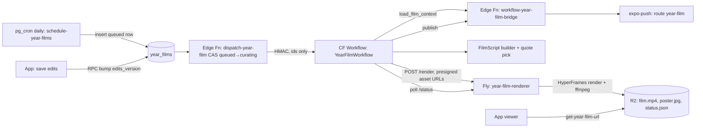

# Year Film — personalized motion-design recap films (Plan)

> Three film kinds: **monthly family recap**, **birthday film** per child, and
> the **year-end family film**. "Year Film" remains the internal name for the
> whole feature.

**Status:** Dogfood in progress — F0, F1 passed; F2 built, awaiting owner review (§10).
**Date:** 2026-09-26
**Working name:** "Year Film" (internal). User-facing titles are per film —
"Leo's Year Two", "Our 2026". **Never "Wrapped"** (Spotify's mark).
**Feature-doc target:** `docs/features/year-film.md` (write in the same PR as the P1 backend work, §10)
**Research basis:** [docs/voice-of-customer.md](../voice-of-customer.md) — §2 themes #1
("it goes so fast"), #3 (texture/voice), #6 (legacy/voice); §8 "Engineer OUT the
daily obligation" and "Tone rule: guilt-relief".

## 1. Outcome

On each child's birthday, Momora hands the family a ~45–60s vertical film of
that child's last year — kinetic type, beat-cut montage of their illustrations
and photos, **their actual voice**, their people drawn as characters, and a
then→now portrait close. In mid-December, the family gets one film of the
whole family's year. And at the start of every month, a short **monthly
recap** of the family's last month — the Google Photos pattern, which cuts
the wait for a first "wow" from a year to a few weeks (added 2026-09-27).

It has three jobs, in order:

1. **A gift that needed zero work.** Produced entirely from what the family
   already saved. No prompts, no "complete your year" step.
2. **The thing parents post.** The in-app film *is* the shareable MP4, with a
   small "made with Momora" end card — every share is organic distribution
   (the UGC-video strategy in `marketing/assets/ugc/`, but made by customers).
3. **The Memory Book's trailer.** A birthday film covers exactly the Memory
   Book's age-year scope; its completion screen offers "Print Leo's Year Two".

The motion language is the launch video's (`marketing/video/momora-launch/`,
HyperFrames): camera moves, match cuts, cuts on the music's downbeats, kinetic
type — rebuilt as data-driven scene modules.

## 2. Locked decisions (2026-09-26 discussion)

| Decision | Choice | Why |
|---|---|---|
| Rendering model | **Server-rendered MP4, played natively in-app** (option A) | One implementation; motion identical everywhere; the shared file is exactly what was watched. Same principle as the book's "one renderer for preview and print". Rejected: live HyperFrames in a WebView (Android GSAP perf, signed-media-in-WebView privacy); native Reanimated re-implementation (two renderers drift). |
| Render host | **Fly.io**, new sibling app `render/year-film-renderer` | Mirrors `render/memory-book-renderer` exactly: Docker + headless Chrome, HMAC-gated, scale-to-zero, R2 in/out, **no DB credential**. Keeps child media off new vendors (no HeyGen cloud, no AWS/GCP). Separate Fly app, not the book machine — video encode is CPU-heavy and must never delay a paid print render. |
| Triggers (v1) | **Birthday film per child + year-end family film** | Birthday = emotional moment we don't have to manufacture; year-end = the synchronized moment when everyone posts recaps. |
| Editing | **Light edits → re-render** | Default is a zero-effort surprise; one wrong photo must not block sharing. |
| Access | **All members watch; owners/managers edit, share, print** | Grandparents (viewers) are the audience; posting a child's video to social is the parents' call. |
| Family film timing | **Mid-December** (surface Dec 15), not Jan 1 | Catches the pre-holiday recap/share wave. Accepted trade-off: the last ~2 weeks of December aren't in the film. |
| Push preference | **Reuse `notify_new_memories`** | No new settings row. |
| Thin-year backfill invite | **No** — ever, not just v1 | A below-threshold child sees nothing. No gallery-import nudge tied to a film. |
| Validation | **Dogfood-first on Eduardo's journal, gated stages F0–F5 before any app/backend work** | Same approach as the Memory Book's V0–V5: prove the output is good on real data, iterate cheaply, then build the product around it. |
| Monthly recaps (2026-09-27) | **Add a monthly family recap** as a third film kind | Time-to-value: a new family gets something meaningful after weeks, not at the next birthday. Reference: Google Photos' monthly recap (§5.1). |
| Video (2026-09-27) | **Video clips are first-class film material** — in the montage, and as the voice source for the sound scene when no audio memory exists | Google's recap is mostly moving clips and it's what makes it feel alive. Every year in the F0 audit has 17–29 videos; audio memories only exist since 2026-08-20. Supersedes the earlier "stills only in v1" rule. |
| Thresholds (2026-09-27) | **Low bar only for monthly; year-scale films need a rich year** | A thin year makes a "meh" film. Monthly ≥10 memories/≥6 visuals; birthday ≥80/≥50; year-end family ≥100/≥60; year-scale films must also span ≥3 of 4 quarters. |
| Whose children (2026-09-27) | **Only the family's own children** get birthday films and family-film chapters | Nieces/cousins with profiles (Eduardo's niece Elena) are excluded. Production mechanism: open question 8 (§12). |
| Dogfood dates (2026-09-27) | **Use the kids' real birthdays as test deadlines** | Enzo turns 4 on 2026-10-23, Mara turns 2 on 2026-11-08 (§10 timeline). |

## 3. Guardrails (non-negotiable, from VoC)

- **Every number and quote is real.** Counts come from rows; quotes are
  code-verified verbatim substrings of a memory's text (the book's quote-title
  rule). No invented stats, no word counts we don't have, no AI-written
  "facts". AI may *select*; it may not *write* on-screen claims.
- **No ranking of people.** "Starring" shows the cast, never "most often with".
  No tag counts per person on screen, no ordering by count.
- **Milestones are celebration only** (`memory-analysis.md` hard constraint).
  Firsts appear only from non-dismissed `memory_milestones`; never "missing"
  milestones, never cross-child comparison.
- **No period-over-period comparison.** Never "down from 40 moments last
  year", and never Google's "That's 10 fewer than July" — the one element of
  their recap we explicitly don't copy. Counts only ever celebrate.
- **Awards are one per child, and every child gets one.** Monthly "award"
  beats (§5.1) name a single child each, positively, from that child's own
  emotion-labelled memories. Never "most/least" across siblings.
- **Thin years are invisible.** Below threshold → no film, no "not enough
  memories" state, no nudge, no backfill invite (decided 2026-09-26).
- **The sibling trap.** A family film gives **equal screen time per child**
  regardless of how many memories each has. Birthday films never appear
  side-by-side.
- **No countdowns** ("summers left", "only N birthdays until…").
- **Private by default.** No public URL. Export goes through the native share
  sheet only. Film storage lives under the owner's R2 prefix.
- **No memory content in logs** (ids and counts only), same as every pipeline.

## 4. The three films

### 4.1 Birthday film — "Leo's Year Two"

- **Scope:** the age-year that just ended **plus the birthday that closes
  it and 2 days after** (`birthdayFilmScope`, decided 2026-09-27), so this
  year's party is the film's ending. Eligibility is judged on the age-year
  itself (`ageYearScopes`, mirroring `buildAgeYearScopeOptions`). Year One =
  birth → 1st birthday (+2 days).
- **When:** the film comes out **3 days after the birthday**, not on the day
  (owner: the party footage is the best possible ending). Close = the
  child's real birthday memories; if the party hasn't been logged by then,
  verified then/now frames, then portraits.
- **Who:** the family's own children (decided 2026-09-27 — not nieces or
  cousins who have profiles; mechanism in §12 Q8), <13 (`classifyChildOrAdult`)
  with a DOB.
- **Pool:** memories in scope that tag the child (`memory_family_members`),
  excluding reported/blocked content and pending/failed illustrations.
- **Eligibility threshold:** ≥80 pool memories, ≥50 visuals (illustration,
  video clip, or photo), spanning ≥3 of the year's 4 quarters. Set high on
  purpose (owner, 2026-09-27): a year film built from a thin year is "meh",
  and curation needs a pool several times larger than the ~25 assets a film
  uses. F1 calibrates this floor by subsampling a rich year (§10).
- **Length:** ~45–60s depending on which scenes qualify and how rich the year
  is. Bursts run at the owner-approved pace (§5, F3 round 2) and the film is
  capped at 60s — the length of a music bed — not the earlier 30–45s/50s aim.

### 4.2 Year-end family film — "Our 2026"

- **Scope:** Jan 1 → the cut-off date (Dec 11, family-local), all memories.
  Memories dated after the cut-off never trigger a re-render; that year's film
  is done.
- **Chapters:** the family's own children (same rule as §4.1) who were born
  before the scope ends.
- **Structure:** family lineup → counts → **one chapter per child, equal
  duration** (portrait + 3 frames + their sound or line) → shared moments
  (memories tagging ≥2 members) → close "Here's to 2027".
- A child with little data still gets a full-length chapter: longer holds and
  the portrait carry it. A child with **zero** eligible memories in the year
  still appears in the lineup and gets a portrait-only beat — never skipped.
- **Eligibility:** ≥100 family memories, ≥60 visuals, spanning ≥3 quarters.
- **Length:** 45–60s (scales with number of children, capped at 60s).

### 4.3 Monthly family recap — "August"

- **Scope:** one calendar month, family-local, all memories.
- **When:** rendered on the 1st of the following month, surfaced that
  evening (19:00 family-local — a couch moment, proposal; §12 Q9). Only the
  most recent completed month is made automatically; past months are not
  backfilled (§12 Q10). A memory backdated into a finished month never
  triggers a re-render.
- **Chapters:** the family's own children born before the month ends — each
  gets one **award beat** (§5.1). Equal time per child, like §4.2.
- **Eligibility:** ≥10 memories and ≥6 visuals. Thin months are silent —
  no film, no "quiet month" message.
- **Length:** 20–35s. Shorter and faster than the year films; mostly motion.
- **Relationship to the other films:** monthly recaps are the frequent,
  light touch; year films are the rare, emotional ones. They share scene
  modules and the renderer; they don't share curation (a year film is not a
  stitch of monthlies).

## 5. Scene modules

Each scene is a self-contained HyperFrames sub-composition that declares its
data needs. The **FilmScript builder** (§7) includes a scene only when its data
qualifies, so a film always degrades gracefully.

| # | Scene | Data | Include when | Notes |
|---|---|---|---|---|
| 1 | **Cold open** | portrait at scope start → at scope end | always (single portrait → one-portrait push-in variant) | Match-cut between ages; title "Leo's Year Two" |
| 2 | **Counters** | counts: moments, photos, sounds, drawings | ≥1 nonzero | Kinetic counters; zero-valued counts are omitted, never shown as 0 |
| 3 | **The sound of the year** | one audio memory tagging the child; else a video clip with the child's voice | an audio memory with ≥2s of voice, or a video clip whose audio has voice (F2 checks with ffmpeg) | The emotional peak. Audio memory: ticket-stub trace from `src/components/audio/` + description caption. Video fallback: the clip plays full-bleed with its own sound. Music carves under either |
| 4 | **The line of the year** | a verbatim quote from memory text | ≥1 verified quote | Caveat handwriting on card stock. Up to 3 candidates stored for the edit swap |
| 5 | **Starring** | tagged people co-occurring with the child in ≥2 memories, portraits at scope end. The **6 most present** (most shared memories, then creation order) get a reveal with up to 3 **moments** each (memories of the child with them, spread over the year, just-the-two-of-them first, each person's own before shared ones) | ≥1 person besides the child | One reveal per person (3 beats: photo → drawing, name, moments fan out as cards), then everyone who qualifies together, up to 9 (2 beats). Shown in stable neutral order (family creation order), no counts — presence decides *who*, never the order on screen |
| 6 | **Their world** | top topics (`memories.topics`, 61-tag vocabulary) | ≥3 topics each on ≥2 memories | Topic labels only; ~35% topic coverage means this often drops |
| 7 | **Firsts** | non-dismissed `memory_milestones` for the child | ≥1 | Label + date, max 4, each with its milestone's own memory as a card (a clip plays in it). Warm wording, same style as the book's `firstsWarmNames` |
| 8 | **Montage** | 8–14 best visuals: video clips (2–3s trims), illustrations, photos | always (threshold guarantees it) | Beat-cut; ≥1 frame per quarter where possible. Off-aspect media sits on a blurred fill of itself (Google's treatment), never letterbox bars |
| 9 | **Close** | first vs last visual of the year, or portraits | always | "Happy 2nd birthday, Leo." / "Here's to 2027." |
| — | **End card** | — | always | The year's tilted mosaic collapses into the m. mark + "made with Momora", ~3s. Baked into the MP4 |

The **print CTA is not baked in** — it's a native button on the completion
screen, so the shared file stays a gift, not an ad.

**Burst pace (owner, F3 round 2 — "the length of the bursts is right now").**
About **one beat per frame** on average (~0.51s at 118 BPM): clips first, up to
1.5 beats; stills share the rest, never under half a beat. The **finale** runs
at ~0.6 beat per frame, its second half at half beats, and cuts straight into
the party (no closing grid). A titled burst adds one beat per title. Cuts sit
on quarter beats. Implemented in `film-renderer/assemble.mjs` (`burst`) and
mirrored in the builder's length estimate (`BURST_SECONDS_PER_FRAME`). The
pace is the default even when the film runs longer; the 60s cap trims burst
frames, never the pace.

**Video clips are first-class (2026-09-27).** A video memory contributes a
2–3s trim to the montage, chosen in F2 (loudness/motion peak, never the first
frame by default); its poster frame is only the fallback when the file can't
be decoded. Multi-asset carousels (up to 10 per memory) can contribute more
than one frame. Render cost of decoding video is measured in F5.

### 5.1 Reference: Google Photos monthly recap (Aug 2026, owner-supplied)

A 42s vertical recap of Eduardo's August, reviewed frame by frame on
2026-09-27. Structure:

| Time | Beat | What it does | Momora take |
|---|---|---|---|
| 0–3s | **Title** | Huge month word ("AUG") on dark navy; photo cards float past at several depths, far ones blurred | ✅ Adopt as the monthly cold open. Mix illustrations and portraits into the floating cards — the thing Google can't do |
| 3–12s | **Count** | "277 photos and videos" over a stack of tilted rounded cards sliding up, white ground | ✅ Adopt (counters scene). ❌ Drop the "That's 10 fewer than July" pill (§3) |
| 12–19s | **Themes** | Drifting diagonal grid of cards; three short playful titles ("Playgrounds / Brick by brick / Trailblazing") + "August 2026" | ✅ Adopt. Our topic vocabulary already has approved playful titles (`TopicDefinition.pageTitle`: "Park days", "On wheels", "Splash!") — no AI-written text needed |
| 19–26s | **Awards** | Full-bleed video of one child: "and the biggest smile award goes to" → name + month; then "and don't forget about…" → the sibling | ✅ Adopt as one award per child (§3). Award wording is templated from the child's dominant emotion: joy → "the biggest smile", funny → "the biggest laugh", mischief → "tiny troublemaker", wonder → "most curious", pride → "proudest moment", tender → "sweetest moment". Each child gets a different award |
| 26–36s | **Montage** | ~1s cuts, mostly video clips with their motion, blurred self-fill for off-aspect media | ✅ Adopt (montage scene) |
| 36–42s | **Outro** | 3×3 grid assembles, brand mark, fade to black | ✅ Adopt as the end card ("m." instead of the Google logo) |

Where Momora goes further than Google: the illustrated characters, a
verbatim quote in Caveat handwriting, and the child's voice — the parts of a
memory a camera roll doesn't have.

**Monthly scene order (v1 proposal):** title → counter → themes (only when
≥2 themes qualify) → one award beat per child → optional line/sound of the
month → montage → outro. The year films keep the §5 table.

## 6. Audio

- **Music:** a small library (4–6) of pre-made instrumental beds, generated
  once (ElevenLabs music, commercially cleared, as for the launch video), each
  shipped with a **beat map** (BPM, downbeat timestamps, drop). Scene
  boundaries snap to downbeats. Per-family music generation is out of scope.
- **Bed choice:** deterministic default by the year's dominant emotion family
  (bright vs tender); swappable among 3 in edits.
- **Voice clip:** trimmed in F2 to its best ≤6s voiced window, then
  loudness-normalized by the assembler to −14 LUFS (phone recordings sit far
  below the bed: Enzo Y4 measured −33 LUFS vs the bed's −13). The bed ducks
  to ~7% under it. The sound scene carries a "Sound on" / "Sube el volumen"
  pill for muted social autoplay. When the voice comes from
  a video clip, the clip's picture plays with it.
- **Montage video clips play muted** under the music bed; only the sound
  scene uses a clip's own audio. Carved under with
  HyperFrames audio ducking (`hyperframes-audio` skill).
- **No voiceover, no TTS.** The child's voice and the type carry the film.
- Sound is on by default in-app. The MP4 must still work muted (social
  autoplay): every scene reads without audio; the sound scene shows its caption.

## 7. Architecture



### 7.1 Scheduling — `schedule-year-films` (pg_cron, hourly)

Template: `migrations/20260713170000_schedule_daily_reminders_cron.sql`
(`net.http_post` + `x-cron-secret`). The family-local date comes from the owner's
`user_profiles.timezone`, the Looking Back pattern (`20260812120000_…` ~L156).

- **Birthday:** at 00:30 family-local **3 days after** the birthday, if the
  age-year meets threshold, insert a `queued` row (scope: `birthdayFilmScope`,
  through birthday + 2 days). **Surfacing** (push + Timeline card) at 09:00
  family-local that same day. Party memories logged after the render don't
  trigger a re-render (v1.1: an optional "Remake with new moments").
- **Birthday, first run:** at launch, don't backfill films for birthdays that
  already passed. Only upcoming birthdays get films.
- **Year-end family film:** insert on Dec 12 family-local (scope Jan 1–Dec 11),
  surface Dec 15 at 09:00 family-local. The three-day gap absorbs render
  queueing and retries. See §11 for the load estimate.
- **Monthly recap:** insert on the 1st of each month at 00:30 family-local
  (scope = the previous calendar month), surface the same day at 19:00
  family-local. Only if the month meets the §4.3 bar.
- Feb 29 DOBs use `addYearsClamped` (Feb 28), same as the book.

### 7.2 Orchestration — Cloudflare Workflow

A new `cloudflare/year-film-worker` (or a second Workflow class in
`memory-book-worker` if bindings stay simple — decide in P1), following
`MemoryBookWorkflow`'s structure:

1. `load_film_context` via the bridge: scope window, child/family, pool memories
   (date, type, content, emotion, topics, tags), media (keys, dims, durations),
   milestones, portrait versions, language, the family's memory-book outline
   **if a ready book exists for the same scope**, and edits.
2. **FilmScript builder** (pure TS, unit-tested; §7.3).
3. **Quote pick:** one small LLM call over candidate memory texts that returns up
   to 3 child quotes with memory ids. Code verifies each is a verbatim
   substring; unverified quotes are dropped. Skipped if a book outline already
   supplies quote-mode titles for this scope.
4. `POST /render` to Fly with the FilmScript and presigned GET URLs. Poll
   `/status` with `step.sleep` (the order-workflow pattern in
   `cloudflare/memory-book-order-worker/src/render-worker.ts`).
5. `publish` via the bridge: CAS `rendering → ready`, set keys and duration, then
   send push at the surfacing time. If already past it (re-render, or a late
   render), don't notify again.

### 7.3 FilmScript

A JSON document that fully determines the film. It's stored on the row (for
edits and re-renders) and is the renderer's only content input.

```jsonc
{
  "version": 1,
  "kind": "birthday",              // | "family_year"
  "language": "en",                // | "es"
  "title": "Leo's Year Two",
  "hideNames": false,
  "musicBedId": "bright-118",
  "scenes": [
    { "type": "cold_open", "portraits": [{ "asset": "a1", "ageLabel": "1" }, { "asset": "a2", "ageLabel": "2" }] },
    { "type": "counters", "counts": { "moments": 147, "photos": 38, "sounds": 12, "drawings": 9 } },
    { "type": "sound", "memoryId": "…", "asset": "a7", "caption": "Leo singing in the bath" },
    { "type": "line", "memoryId": "…", "quote": "the moon is following us", "candidates": ["…"] },
    { "type": "starring", "people": [{ "name": "Grandma Lucía", "asset": "p3" }] },
    { "type": "montage", "frames": [{ "memoryId": "…", "asset": "a9", "date": "2026-03-12" }] },
    { "type": "close", "from": "a2", "to": "a14", "line": "Happy 2nd birthday, Leo." }
  ],
  "assets": { "a1": { "key": "<r2 key>", "kind": "image", "w": 1024, "h": 1024 } }
}
```

**Selection rules** (deterministic, ported from the book's pure helpers where
possible: `computeMemoryEligibility`, `isPrintable` in
`memory-book-worker/src/eligibility.ts`, `buildBackboneSegments` in
`backbone.ts`):

- **Montage:** prefer the book outline's `heroCandidates`/`coverCandidates`
  when present. Otherwise score by emotion weight (joy/funny/wonder/tender high,
  worry/sad excluded), ready illustration > photo, engagement as a light
  tiebreak (it's sparse, ~2.5%). Dedupe same-day. Spread across quarters.
- **Sound:** prefer emotion joy/funny/tender with a non-empty description. The
  longest voiced clip wins ties.
- **Close:** portrait versions at scope start vs end via
  `resolvePortraitVersionAtDate`. If both resolve to the same version, use the
  book's `coverCandidates` (vision-checked face-visible) first vs last. Else the
  montage's first vs last frame.
- **hideNames:** replaces names with relationship-free generic text ("Year Two",
  "Starring" without name labels). Title becomes "Year Two".

### 7.4 Renderer — `render/year-film-renderer` (Fly)

A thin service around `film-renderer/` (§9), built after F5 proves the image.
Clone the book renderer's shell: `src/server.ts` (`/health`, `/render`,
`/status/:attemptId`), `src/crypto.ts` HMAC (same timestamp+nonce+body
scheme), R2 conditional-put `status.json` for cross-machine idempotency, no DB
or third-party credentials.

Render steps:

1. Download every asset from its presigned URL to local disk (no network during
   frame capture — determinism). Downscale images to ≤1440px on the long edge
   and trim/normalize the voice clip.
2. **Assemble the composition** from the prebuilt `film-renderer/` scene
   modules baked into the image. The assembler computes each included scene's `data-start` /
   `data-duration` from the beat map and writes `index.html`. Text/asset values
   are written into the generated HTML by `film-renderer/assemble.mjs` —
   HTML assembly, not HyperFrames variables (answered in F3, §10).
3. `hyperframes render` → 1080×1920, 30fps, H.264 + AAC, `--video-frame-format
   jpg` (PNG extraction filled the disk in marketing renders). Pin the
   HyperFrames version (currently 0.8.73) in the image.
4. Extract `poster.jpg` from the close scene. Upload `film.mp4` and `poster.jpg` to
   `{ownerId}/year-films/{filmId}/{attemptId}/` with S3 credentials, as the
   book renderer does.

Image: Node 22, Chrome for Testing, ffmpeg/ffprobe, `linux/amd64` pinned (see
the book renderer's Dockerfile notes). Brand fonts (Newsreader, Plus Jakarta
Sans, Caveat) are vendored into the image — no font fetches at render time.
VM size is set by the F5 benchmark (start `performance-2x`, 4GB,
`hard_limit = 1`).

### 7.5 Data model — `year_films`

| Column | Notes |
|---|---|
| `id` uuid pk | |
| `family_id` | fk |
| `kind` | `birthday` \| `family_year` \| `family_month` |
| `family_member_id` | nullable; required for `birthday` |
| `scope_start_date`, `scope_end_date` | inclusive, frozen at insert |
| `scope_label` | "Year Two", "2026" |
| `status` | `queued → curating → rendering → ready`; `failed`; `stale` (ready but needs re-render; old video stays playable) |
| `film_script` | jsonb (§7.3) |
| `edits` | jsonb: `{ removedMemoryIds[], quoteIndex, hideNames, musicBedId }` |
| `edits_version` | int, bumped per saved edit; the render attempt records which version it rendered |
| `video_key`, `poster_key`, `duration_ms` | set on ready; previous keys retained until the new attempt succeeds |
| `surface_at` | timestamptz: birthday + 3 days 09:00 / 1st of month 19:00 / Dec 15 09:00, family-local |
| `attempt_id`, `error_code` | |
| `created_at`, `ready_at` | |

- Unique partial index: one non-failed film per `(family_id, kind,
  family_member_id, scope_start_date)`.
- `year_film_views (film_id, user_id, first_viewed_at, completed_at)` for
  personal viewed state (Timeline card dismissal), same as Looking Back.
- **RLS:** members `select` (only where `surface_at <= now()` — no peeking at a
  birthday film early); owners/managers edit only through an RPC
  (`save_year_film_edits`) that validates the edits shape and flips `ready →
  queued` with CAS. Every status transition is service-role, the
  `memory_books` precedent.
- Regenerate types and update TECH_SPEC in the same PR (CLAUDE.md rule 4).

### 7.6 Invalidation

A film must never keep showing something the family removed:

- **Memory deleted / media removed / content reported / author blocked** →
  films whose `film_script` references that memory go to `stale` and
  **immediately** stop serving the old video. `get-year-film-url` refuses
  `stale` films that reference a removed memory, and the Timeline card hides.
  Then re-queue automatically. (Trigger or a check in the existing deletion
  paths — decide in P1.)
- **Member removed from the family** → same as above for films where they appear.
- **Backdated memory added into a ready film's scope** → nothing happens
  automatically (no surprise re-renders). The edit screen could show "Remake
  with new moments" (v1.1).
- Account deletion: covered by the owner-prefix R2 cleanup, since keys live under
  `{ownerId}/`. **Data export:** include `film.mp4` per film (the archive is
  never hostage — this is part of it).

### 7.7 Fair use

A new, invisible cap (the `usage-limits.md` philosophy — no counters shown):
**5 re-renders per film per day**, **20 renders per family per day**. When hit:
"Your changes are saved — your film will update tomorrow." Scheduled renders
never count against the cap.

## 8. App surfaces

- **Timeline card** (top of Timeline, above Looking Back, while unviewed and
  within 14 days of `surface_at`): poster frame, "Leo's Year Two is here",
  dismissible. Personal viewed state.
- **Push** at `surface_at`: "Leo's second year, in one little film 🎂" / "Your
  family's 2026, in one little film" / "Your August, in one little film". New `PushRouteData.route` value
  `year-film` in both `supabase/functions/_shared/expo-push.ts` and
  `src/hooks/useNotifications.ts`. Gated on the existing `notify_new_memories`
  preference (decided 2026-09-26); no new setting.
- **Child profile → "Films" row:** every past film for that child. Family
  films (year-end and monthly) live under a Timeline overflow → "Films".
- **Monthly recaps are lighter-weight in the UI:** a smaller Timeline card
  that expires after 7 days, and no print CTA on completion (there's no
  monthly book).
- **Viewer** (`app/(app)/year-film/[id].tsx`): full-screen `expo-video`, sound
  on, with a native overlay:
  - segmented progress bar from FilmScript scene boundaries (the look of
    `src/components/looking-back/story-progress.tsx`)
  - tap right/left = next/previous scene (seek); hold = pause; mute toggle
  - **completion screen:** Replay · **Share** · **Edit** · **Print this year**
    (the last three for owners/managers only; Print opens the Memory Book scope
    picker preset to this age-year; hidden for family films)
  - screen readers: an accessible scene list (title, counts, quote, caption) with
    play/pause controls. Reduce Motion: the viewer shows a warning line on the
    intro ("This film has a lot of motion") and offers the scene list — the
    motion is baked, so there's no alternative render in v1.
- **Share:** `get-year-film-url` (Edge Fn, role-checked) returns a short-TTL
  presigned URL → `FileSystem.downloadAsync` to cache (not the base64 path
  `useShareMemoryCard` uses for PNGs — too big) → `Sharing.shareAsync(uri,
  { mimeType: 'video/mp4' })` → delete. The iOS share sheet already offers
  "Save Video", so no `expo-media-library` write permission in v1 (avoids a
  new Play permissions declaration).
- **Edit sheet** (owners/managers, keyboard-free): hide a montage frame (tap to
  toggle), swap the line of the year (≤3 candidates), hide names, music (3
  beds with 5s previews). "Save" → RPC → "Remaking your film… (about 2 min)".
  The previous version keeps playing until the new one is ready, the portrait
  precedent.
- No new native modules (`expo-video`, `expo-sharing`, `expo-file-system` are
  already present) → shippable via EAS Update on the current runtime. Verify in
  P2.

## 9. Visual design & motion

- **Workspace:** a top-level `film-renderer/` package, the film's twin of
  `book-renderer/`. It holds the HyperFrames project (scene modules as
  sub-compositions), the assembler (FilmScript → `index.html` + variables),
  music beds + beat maps, vendored fonts, local preview/render scripts, and
  `film-data/` (gitignored real-family data, see §10) with a committed
  `film-data/sample/` synthetic fixture. The Fly service
  `render/year-film-renderer` wraps it later via a **named Docker build
  context whose `.dockerignore` excludes `film-data/`**, the same PII lesson
  as the book renderer's Dockerfile.
- Design spec (`frame.md`) derived from the Anchor Journal system: lavender
  palette, Newsreader display, Plus Jakarta UI type, Caveat for quotes,
  card-stock textures, the ticket-stub audio trace and wax seal.
- Reuse the launch video's registry blocks where they fit (text-match-cut,
  whip-pan-cut, parallax-unzoom, motion-blur) — see
  `marketing/video/momora-launch/hyperframes.json`.
- Design with **worst-case data** from day one: a minimal film (counters +
  montage + close), 1:1 illustrations next to 4:3 and 9:16 photos, long names
  ("Maria Guadalupe"), Spanish strings (~25% longer), a single portrait
  version, a four-child family film.
- **Social-safe layout:** keep type and faces inside TikTok/Reels/Stories safe
  zones (clear of the right-rail buttons and the bottom caption area); every
  scene must read on mute.

## 10. Validation plan — dogfood-first, gated (F0–F5), then product (P1–P3)

Like the Memory Book (docs/plans/memory-book.md §9), the film is built and
judged **against Eduardo's real journal before any product surface exists**.
Stages F0–F5 are eval scripts and local renders only: **no migrations, no app
code, no deploys, no customer-visible change.** Each stage produces an
artifact Eduardo reviews, and its results are recorded in this doc
(`### F<n> results` subsections below this table, like the book's
`### V<n> results`).

Conventions (same as `eval:memory-book-*`):

- Deno scripts in `supabase/scripts/eval-year-film-*.ts`, run via
  `npm run eval:year-film-*` with `--env-file=supabase/.env.local
  --env-file=.env.local`. **Read-only**: every data read goes through the
  RLS-scoped client (the service-role client only bootstraps the session),
  exactly like `eval-memory-book-assets.ts`.
- Real-data outputs go to gitignored locations only:
  `supabase/scripts/eval-output/` (reports, storyboards) and
  `film-renderer/film-data/` (manifest + downloaded assets + renders).
  stdout stays counts-only. Nothing with memory content is committed.
- Logic that production will need (eligibility, FilmScript builder, quote
  verification) is written from the start as pure modules in
  `supabase/functions/_shared/year-film-*.ts`, which the eval scripts import.
  **Passing a stage means the production logic passed**, not a throwaway
  copy. (Lesson from the book: its outline logic had to be lifted from eval
  code into `_shared` later.)

| Stage | Build | Review artifact | Pass question |
|---|---|---|---|
| **F0 — Data audit** | `eval:year-film-audit -- --children Enzo,Mara`: for every child × every age-year, both year-end family films, and every completed month, count the pool and evaluate each scene's "include when" rule (§5). | Table per scope: memories, visuals, sounds with voice, quote-candidate memories, topics meeting the rule, milestones, distinct portrait versions → **which scenes would render**, film length estimate. | Are the thresholds (§4) right? How many scenes does a typical film get? Which scenes almost never qualify (e.g. "Their world" at ~35% topic coverage)? |
| **F1 — Script + storyboard** | `_shared/year-film-script.ts` (FilmScript builder, §7.3) + `_shared/year-film-quotes.ts` (LLM quote pick + verbatim verification); `eval:year-film-script --children Enzo,Mara --film <birthday:Enzo:4\|family-2026\|month:2026-09>`. Plus `--subsample <n>`: rebuild a rich year's storyboard from a random n-memory subset, to find where quality drops. | An **HTML storyboard** per film in `eval-output/`: each scene in order with its thumbnails (video clips as poster + trim range), quote (plus the other candidates), sound source (audio memory or video) and length, award per child (monthly), montage frames with *why each was picked*, the close pair, and the scenes dropped with the reason. Plus the raw `film-script.json`. Storyboards for: Enzo Year Four, Mara Year Two, September 2026 monthly, and Enzo Y3 subsampled at 40/60/80/120. | **Are these the right moments?** Would you choose this quote, this sound, these frames, these awards? **Where does a year start to feel "meh"?** (sets the §4 floors). This is the moat checkpoint — iterate here (cheap) until the storyboard itself is moving, before any motion work. |
| **F2 — Asset bridge** | `eval:year-film-assets`: FilmScript → `film-renderer/film-data/<slug>/` (`film-script.json` + downloaded, downscaled images + voice clip trimmed to its voiced excerpt via ffmpeg `silencedetect`). Mirrors `eval-memory-book-assets.ts`. | Asset report: every referenced asset present, dimensions, clip excerpt boundaries (listen to each excerpt). | Is every asset resolvable and good enough at 1080×1920? Does the excerpt trimming land on the voice, not on silence or a cut-off word? |
| **F3 — Motion + local render** | `film-renderer/`: scene modules (year + monthly sets, §5/§5.1), assembler, 4–6 music beds + beat maps, video-clip handling. `npm run film:preview -- <slug>` (HyperFrames Studio) and `npm run film:render -- <slug>` (local MP4). Answers the open technical question: conditional scenes via HTML assembly (the `momora-shorts/build.py` approach) vs HyperFrames variables. | Local MP4s, on the phone at full volume and on mute, in date order: **Enzo's Year Four for his real birthday (Oct 23)**, the **October 2026 monthly (Nov 1)**, **Mara's Year Two for her real birthday (Nov 8)**; then the past years, a few past months, "Our 2026 so far", and the `sample/` worst-case fixtures. Owner review rounds recorded as `### F3 owner review round N`. | Does it feel like the launch video? Would you post it? Do the worst cases still look intentional? Does the sound scene land? |
| **F4 — Real-world share proof** | Nothing new — share the real birthday films on the real days (family WhatsApp, Instagram Story) and upload privately to TikTok. | The film after WhatsApp/iMessage compression, as an Instagram Story, and uploaded **privately** (only-me/draft) to TikTok; screenshots of platform UI over it. Optionally shown in person to a few parent friends. | Does it survive compression (text edges, audio)? Is anything under the platform UI? Does it read muted? What do other parents say when they watch it? |
| **F5 — Render infra benchmark** | `render/year-film-renderer` Docker image (the §7.4 shell, no Workflow yet), run with an F2 `film-data/` directory mounted locally, then once on a scale-to-zero Fly machine with the **sample** fixture only (no real family data leaves the laptop until P1). | Render time, peak memory, output size, estimated cost/film at `performance-2x` vs `performance-4x`; byte-identical-ish output vs the local F3 render. | ≤3 min and ≤$0.05 per 40s film? Does the Dec 12 spike (§11) fit Fly autoscale limits? Results replace §11's estimates. |

**Gate:** do not start F(n+1) before F(n) passes. F0–F2 are cheap and prove
the curation thesis before any motion work; F3 is the long iterative stage.
F5 can run in parallel with late F3 rounds (it only needs the sample fixture).

### F0 results (runs 2026-09-26 and 2026-09-27, `npm run eval:year-film-audit`)

Module: `supabase/functions/_shared/year-film-eligibility.ts` (+ 17 Deno
tests). Reports (gitignored): first run `…/2026-09-26T22-39-02-469Z-report.md`
(all children, stills-only, low thresholds); re-run after the owner's
2026-09-27 decisions `…/2026-09-26T23-07-01-193Z-report.md`
(`--children Enzo,Mara`, video clips, monthly recaps, higher year floors).
One family, 772 memories.

**First run → owner decisions (2026-09-27):** Elena is a niece → own
children only. Sound scene hit 0% of completed years → use video clips as
the voice fallback, and make video first-class. Thresholds of 10/6 would
admit "meh" years → keep that bar for monthly recaps only, raise year films.

**Re-run findings:**

- **Birthday films:** all 4 completed age-years qualify at 80/50/3-quarters
  (Enzo Y1 161, Y2 103, Y3 194; Mara Y1 170), plus both in-progress years
  (Enzo Y4 141, Mara Y2 147). Sensitivity is flat up to 100 and only drops at
  150, so this family can't locate the floor from counts → **F1 subsampling**
  decides it.
- **Video changes the picture:** 17–29 video clips per year; with the video
  fallback the sound scene now hits **100%** of eligible years (was 0%).
  Median 9 scenes, but estimated length rises to ~46s → the montage must
  shorten when the sound scene is long (F3).
- **Year-end family films:** 2025 = 277 memories / 30 clips / 4 quarters;
  2026 so far = 170 / 27 / 3 quarters (Q4 fills by Dec 11). Sibling gap with
  own children only: **1.1–1.2×** (it was 127× with the niece included).
- **Monthly recaps:** **33 of 47** completed months qualify at 10/6; median
  13 memories/month, median 3 video clips in eligible months. Recent months
  are rich (Jul–Aug 2026: 32 each, 6–7 clips). Busy months cluster where
  gallery import and illustrations are active (2025-08/09: 44–49).
- **Theme triplet:** only ~half of eligible months have ≥2 qualifying topics
  → the themes beat must be optional in the monthly film. Page titles read
  well as Google-style labels ("On wheels / Park days / A day at the beach").
- **Awards:** every chapter in every eligible month has award candidates
  (emotion-labelled visuals), so one award per child is always possible.
- **Chapters respect birth dates:** Mara gets no chapter before Nov 2024 (a
  bug in the first re-run, fixed via `chapterChildren`).
- Carried over from the first run: backfilled years (Enzo Y1–Y2) have no
  illustrations and no text → the look must work photo-and-video only;
  "Their world" should rank topics by distinctiveness, not frequency;
  Starring needs a cap (3–9 people/year).

**Status:** F0 passed (owner decisions recorded 2026-09-27).

### F1 results (runs 2026-09-27, `npm run eval:year-film-script`)

Modules: `_shared/year-film-script.ts` (FilmScript builder),
`_shared/year-film-quotes.ts` (quote pick + verbatim verification), eval
loader `supabase/scripts/year-film-eval-data.ts`; 34 Deno tests across the
three year-film modules. Storyboards (gitignored) under
`supabase/scripts/eval-output/year-film-script/`: run
`2026-09-26T23-36-52-869Z` (Enzo Y4, Mara Y2, Aug + Sep 2026 monthlies) and
`2026-09-26T23-37-20-370Z` (Enzo Y3 full + subsampled to 40/60/80/120).
Serve locally with the `film-storyboards` launch config (port 5188).

**Fixed during F1 (found by reading the first storyboards):**

- **Share safety** — potty-training moments (3 in Enzo's montage + a
  "Potty trained" first) would have gone into a publicly posted film. New
  rule (`shareSensitiveIds`): bath / doctor-dentist / tough-days topics,
  potty / bath / dentist / weaning milestones, and a bilingual keyword check
  never appear in any frame, quote, sound or first. Low-mood emotions
  (worry, sad, weary) stay out of every frame, not just the montage.
- **Catalog text leaked** ("Birthday (every year, detail = age turned)") →
  birthday is not a "first"; parenthetical notes are stripped.
- **Sibling films were near-identical** (≈half the montage shared) → birthday
  films score solo moments up; now 2 of 11 frames overlap.
- **Mara's sound was Enzo's voice** ("Enzo contándole un cuento a Mara") → a
  clip whose description names another child first isn't this child's
  voice. Mara's sound is now a video clip of her.
- Close no longer repeats the cold open's portraits (real frames, then → now);
  theme cards don't reuse montage frames; year-film themes need ≥3 memories;
  counters use singular forms ("1 sonido"); monthlies keep one voice beat
  (sound over line), bringing them from ~39s to ~35s.

**Quote pick:** every quote the model returned passed verbatim verification
(Enzo Y4 5/5, Mara Y2 1/1, Aug 3/3, Sep 4/4). Enzo's line of the year:
"papi, el mundo es un lugar mágico!". Mara's (age 1–2) only candidate is
"de nada" — toddler years will often have a weak or no line.

**Subsampling Enzo Y3 (194 memories):** montage quality degrades gently
(mean frame score 2.06 → 1.94 @120 → 1.85 @80 → 1.80 @60 → 1.85 @40), but
the mix changes: moving clips 7 → 6 → 5 → 3 → 2 of 11, the year's only first
disappears below 120, and themes drift from specific ("Sweet treats",
"Blocks, trains & toys") to generic ("Park days", "Yummy memories") at
≤60. The numbers support the 80 floor; the owner's eye decides.

**Known gaps (not fixed in F1):**

- **Spanish labels.** Topic page titles and milestone names exist only in
  English, so Spanish films show "On wheels / A day at the beach" → §12 Q12.
- **Selection is metadata-only.** No vision check for blur, faces or
  composition (the book uses one for cover candidates). Owner review decides
  whether F2 needs a vision pass.
- **Montage emotion variety:** most picks are "joy"; no diversity rule yet.

### F1 owner review round 1 (2026-09-27) → round 2

Owner feedback on the first storyboards, and what changed:

1. **"Still thin on media."** → Films now alternate **focus beats** (portrait,
   line, starring, sound, firsts, awards, close) with **bursts** — many
   photos and clips in quick succession, Google-style. Birthday: bursts for
   each half of the year plus a faster finale (46 frames vs 11 before);
   monthly: themes grid + finale burst (29–34 frames). Bursts use up to 3
   photos of a multi-photo memory.
2. **"Too heavy on illustrations."** → Captions no longer decide between
   media kinds; bursts follow a target mix (35% clips, 45% photos, 20%
   drawings). Birthday bursts came out ≈43% photos / 33% clips / 24%
   drawings. Portraits now carry their source photo (`pairKey`) so the cold
   open and starring can do a photo → illustration transform, like the book.
3. **"Mimic the language the user uses."** → The book's precedence: the
   language the model reads in the journal, then detected function words,
   then the family setting (`year-film-i18n.ts`). Hand-written Spanish labels
   for all 63 topics and 78 milestones.
4. **"Biggest smile → Enzo" was a group video.** → New vision frame check
   (`year-film-vision.ts`): reference photo per child + candidate frames →
   main subject, face visible, expression, quality, unsafe. Every claim
   about a child (award, then/now close, voice-fallback clip) needs a
   verified frame of that child as the clear subject; crying/frowning
   frames never back a claim. Awards are limited to what a frame proves:
   **biggest laugh / biggest smile** (verified expression) or **star of the
   month** (verified subject); otherwise the child's portrait. Text-emotion
   awards (troublemaker, curious, sweetest) are gone. All vision candidates
   parsed (16–18 per film).

**Subsampling, round 2 (Enzo Y3, with vision):** at 194 and 120 memories
the film keeps every scene; **at ≤80 it loses the voice beat and the
firsts** (too few clips verified to show him: 20 → 10 → 6 → 5 → 3 in the
pool) and burst clips collapse to 1–4. Suggests the birthday floor sits at
~100–120, or that year films should require a voice beat.

Storyboards: runs `2026-09-27T15-22-46-118Z` and `2026-09-27T15-25-20-124Z`;
single-file bundles `year-film-F1-v2-*.html` in the same folder.

### F1 owner review round 2 (2026-09-27) → round 3

- **Firsts must be certain** (owner: "Primera pregunta" / "Primer corte de
  pelo" in Year 4 were wrong). `isCertainFirst`: parent-confirmed, or the
  memory's own text says "first" (primer/primera vez/estrenó/first…) AND
  the claim is inside the milestone's age band (`out_of_band` now loaded).
  Result: Enzo Y4 keeps one first; Mara Y2 and Enzo Y3 have none (scene
  drops). The milestone *type* is still the model's reading — e.g.
  "Estrenando bicicletas sin rueditas" is labeled balance-bike.
- **The birthday close carries real birthday memories**: tagged to the
  child, dated on the birthday or carrying the deterministic (DOB-join)
  birthday milestone, −1/+3 days. Falls back to verified then/now frames,
  then portraits. With the current age-year scope, the party in scope is the
  one at the START of the year → open question 14.
- **Emotion bursts** ("The funny ones" / "Tiny troublemakers" — "Los
  momentos más graciosos" / "Pequeñas travesuras"), Looking Back's
  packages: whichever of funny/mischief has ≥4 unused visual memories.
  All three birthday films got one; neither monthly had enough left.
- **Floor = 60** memories (40 visuals, 3 quarters) for birthday and
  year-end films (owner, from the subsamples). Above it, bursts scale with
  the year (~35% of visuals, 36–72 frames) and are trimmed to the **50s
  cap** (owner: aim 30–45s, 50s fine). Birthday films now carry 52–61 burst
  frames at 47–50s.
- Awards: approved as is.

Storyboards: run `2026-09-27T15-45-00-086Z`; bundle `year-film-F1-v3-storyboards.html`.

**Owner answers (2026-09-27):** birthday timing (b) — out 3 days after the
birthday, closing on this year's party (`birthdayFilmScope`); Spanish labels
approved; year-end family film floor 60 confirmed.

**Status: F1 PASSED (2026-09-27).** Next: F2 (asset bridge).

### F2 results (2026-09-27, `npm run eval:year-film-assets`)

Modules: `_shared/year-film-trim.ts` (ffmpeg measurement parsing, voiced
segments against the clip's own noise floor, voice-excerpt and burst-window
choice) and `_shared/year-film-voice.ts` (audio-model voice check,
`gpt-audio-1.5`); script `supabase/scripts/eval-year-film-assets.ts`. Input:
the reviewed FilmScripts of F1 run `2026-09-27T16-14-31-003Z` (regenerated
with the through-the-birthday window). Output (gitignored):
`film-renderer/film-data/<slug>/` — `film.json` (every frame annotated with
file, usage, trim, source dimensions, voice verdict), `assets/`, and a
playable `asset-report.html`; index at `film-renderer/film-data/index.html`.
59 Deno tests across the year-film modules.

- **Per film:** 28–71 stills, 3–16 burst clips (2.5s each; vertical 1080×1920
  where the source allows), verified award clips (first 3s — the frame the
  vision check saw; posters are captured at t=0), one voice excerpt (≤6s).
- **Voice check works and matters.** Heard: Enzo Y4 "child speaking or
  singing alone"; Enzo Y3 "child singing happy birthday with clapping" (a
  video, 89% voiced); Mara Y2's first candidate was "adult and child talking
  together" → rejected, and with only one candidate the scene would have
  dropped. Fix: the builder now sends 10 voice-fallback candidates to vision
  and keeps up to 5 verified alternates; Mara's now passes ("a child
  repeating short sounds").
- **Drawings are 1024px** — a ~5% upscale on a 1080-wide frame, fine for
  video (unlike print). Warning threshold set to <900px. Remaining warnings
  (7 across 5 films): two excerpts only ~31–38% voiced, a few low-res photos
  (810px short side).
- Audio-model verdict wording varies run to run (same September clip:
  "coughing and speaking softly" → "laughing and talking in background"); the
  pass/fail stayed the same.
- Not covered yet: HEIC stills go through macOS `sips` — the Linux renderer
  (F5) needs libheif.

### F2 owner review round 1 (2026-09-27)

Owner: "the rest looks really really good", plus four issues:

1. **Mara's film had a clip of Enzo** (tagged with Mara; the cut window
   showed Enzo). Burst frames were never looked at, and for videos the
   vision check had only seen the poster (t=0), not the window F2 cuts.
2. **A clip "showing nothing"** (Enzo Y4 and Sep 2026) and 3. **a clip with
   the important part cropped** (Enzo Y3) — both baby-monitor / screen
   recordings (night vision, "21°C" overlay, app UI). The report also
   cropped landscape clips to 9:16; the cuts themselves keep the full frame
   (the renderer letterboxes them on a blurred fill).
4. **September's voice excerpt started with coughing.**

Fixes:

- **F2 frame check** on what the film actually shows: every burst, title,
  end-card and celebration frame, clips on a frame from the middle of the
  chosen window. New vision field `screen_capture` (screenshots, screen
  recordings, app/game UI, baby-monitor/security/night-vision footage) →
  removed everywhere, also from F1 claims. In birthday films the child must
  be visible (`isUsableBurstFrame`). A failing clip is re-cut from its next
  ranked window (`rankClipWindows`) and re-checked before removal; removals
  are shown in the report.
- **Voice check** gains `starts_cleanly` (no cough/bump/noise in the first
  second); each clip gets up to 3 voiced windows (`rankVoiceWindows`) before
  the next candidate clip.
- Report shows media whole (`object-fit: contain`), as the renderer will.
- FilmScripts now carry `subjects` (child id, name, reference photo key) so
  F2 can check frames without the database.

**Round 2 results** (F1 run `2026-09-27T16-33-56-395Z`): the first frame
check removed 30 of 64 frames from Enzo Y3 — 20 were drawings (vision can't
match a drawn face to a reference photo) and 3 were photos where the model
named the child as main subject but left them off `children_visible`. Fixed:
drawings skip the frame check (drawn from the memory's tagged people — the
tags' assurance), and the main subject counts as visible. Re-run: **4–10
removals per film** (screen/monitor footage, child absent, blurry, a few
unsafe); September's voice excerpt: window 1 rejected for a noisy start,
window 2 passes. 61 Deno tests.

### F2 owner review round 2 (2026-09-27)

Owner: almost every removal should have stayed — toddlers in diapers or
shirtless, crying/tantrum faces (the "funny ones" burst), blurry and group
frames, face-hidden frames, even the app screen recording and the
baby-monitor clip. Round 1's real complaints were a sibling-led clip in a
birthday film, an empty clip window, and crops (a report artifact).

New burst rule (`burstFrameVerdict`): **keep by default.** Remove only when
(a) the frame is genuinely unsafe — narrowed to nudity beyond everyday
toddler dress, toilet use, or a medical procedure; diapers, shirtless,
crying and messy eating are explicitly *not* unsafe — or (b) in a birthday
film, a sibling is clearly the main subject and the birthday child isn't
visible at all. A clip whose window shows no one tries its other windows
and otherwise keeps its original. FilmScripts carry `references` for all
the family's own children so a sibling is recognizable. Claims (awards,
then/now) keep their stricter checks.

**Round 3 results** (F1 run `2026-09-27T17-11-17-359Z`): removals are now
only sibling-led frames — Enzo Y4: 2 (Mara the subject); Mara Y2: 4 (Enzo
the subject, incl. the app screen recording from round 1); Enzo Y3, Aug and
Sep: 0. Voice excerpts all pass.

**Round 3 review:** a Mara-only photo (hooded blanket) was removed from
Mara's film as "Enzo" — siblings look alike to the vision model. Rule
tightened: vision can only remove a sibling-led frame when the memory is
also tagged with that sibling (frames now carry `tags`). Round 4 (F1 run
`2026-09-27T17-3x`): Mara Y2 2 removals and Enzo Y4 2, all on memories
tagged with both kids; the hooded photo stays. Report shows each removed
photo/clip once (the end card reuses finale frames).

**Status:** passed (owner approved; F3 started 2026-09-27).

### F3 results (2026-09-27, `node film-renderer/assemble.mjs <slug>`)

- **Workspace:** `film-renderer/composition/` is the HyperFrames project
  (pinned `hyperframes@0.8.80`): `frame.md` (design spec), `STORYBOARD.md`
  (the 12-frame template, owner-locked v2), `BRIEF.md`, vendored fonts and
  the launch bed. `film-renderer/assemble.mjs` turns
  `film-data/<slug>/film.json` into `index.html` (music bed with a volume
  lane, the year strip) plus one sub-composition per scene under
  `compositions/`, and copies the film's assets to `assets/film/`. All
  generated files, Studio caches and snapshots are gitignored (family data).
- **Open question answered:** conditional scenes are **HTML assembly**, not
  HyperFrames variables — scenes drop in and out and bursts vary in length.
- **Timing:** every scene is a whole number of beats on the bed's grid
  (118 BPM, drop 8.146s lands inside the first burst).
- **Checks:** `npx hyperframes check` passes (lint, runtime, layout, motion,
  contrast 36/36 AA). Snapshots are written to a scratch folder with
  `--describe false` (the describe step would send family frames to Gemini).
- **Year strip:** only the span's two dates; a rose dot jumps to each
  moment's real date, hides when a scene has no single date, and a seal
  stamps the end at the party. The party label stays blank — the photos are
  last year's party, so the strip doesn't claim a date for them.
- **Finding:** the builder splits the year's halves by memory count, so the
  "first half" burst of a journal that got dense in July reaches into
  July–August. The renderer sorts each burst by date so the dot only moves
  forward; revisit the split in the builder.

### F3 owner review round 1 (2026-09-27)

Owner: "it looks awesome." Changes: confetti showed before the party photos
(GSAP `fromTo` renders its start state at once) → it now bursts from behind
the photos as they land. The end card's 3×3 grid was awkward → the counters'
mosaic, **tilted −8° and denser** (9 columns, 108 tiles; builder
`BACKDROP_TILES` 48 → 108), opens the end card and collapses into the mark.
Bursts felt too fast → about 30% more time per frame (47.8s → 53.9s).

### F3 owner review round 2 (2026-09-27)

- Burst pace approved as the default, even when films run longer (§5; cap
  50s → 60s in builder and renderer).
- **Starring** "needs more personality and emotion" → a reveal per person
  with up to three moments of the child with them as cards, then everyone
  together (§5 row 5; builder `starringMoments`, F2 prepares them as stills).
- **Sound** too quiet → voice normalized to −14 LUFS, bed ducked to 7%, and a
  sound-on pill (§6).
- Finale grid removed — straight cut to the party.
- Confetti faster, out from behind the photos, falling in front of them.
- The builder's length estimate now mirrors the renderer's layout (a beat
  per burst frame on average, ~0.6 in the finale, a beat per title, the
  emotion burst's title + 4 cards, per-person starring). Its first version
  over-counted clips and trimmed 6 burst frames from a film that fit.
- Enzo Y4 runs ~59s.

### F3 owner review round 3 (2026-09-27)

- **"Why no memories with me?"** Starring took the first 6 qualifying people
  in profile creation order, so four early relatives with 2–4 shared
  memories each filled the slots and Eduardo (22 shared) never appeared. Now
  the 6 most present people get reveals (still shown in creation order, no
  counts) and the closing group shot holds everyone who qualifies, up to 9.
- Firsts: the milestone's own memory is shown as a card above its stamped
  label (4 beats per first with a card).
- Confetti fell a fixed distance and stopped on screen → it now falls off
  the bottom edge.

### F3 monthly films + split fix (2026-09-27)

- **Draft render** of Enzo Y4 (`npx hyperframes render`, local M-series):
  59.5s, 1080×1920/30fps H.264+AAC, 65MB, 1m51s. Clips decode frame-accurately
  in capture; the sound scene measures −16 LUFS vs −14 for music-only
  sections (the voice is no longer buried). Only render-visible issue: the
  year strip's cream labels over bright clips → soft text shadow on dark
  scenes.
- **Split fix:** `pickBurst` now only takes memories inside its own window
  (it used to top a thin half up with the year's best, which put July–August
  frames in Enzo's "first half"). A half with <4 frames is folded into the
  finale (`pushHalfBurst`), and the finale absorbs any shortfall so the film
  keeps its burst length.
- **Monthly scenes:** `title` ("Nuestro" + month name fitted to the width +
  year, with the month's cards popping into a collage) and `award` (intro
  line, the verified photo/clip as a card, the name, a rose ribbon when the
  intro doesn't already name the award). One-month strips read "1 ago — 31
  ago"; the mosaic sizes itself to the film (5–9 columns). Aug 2026: 36.1s,
  Sep 2026: 31.5s.
- **Owner review (monthlies):** "both monthlies look awesome"; the Enzo Y4
  render "looks and sounds great". Nit: the second award read "y no nos
  olvidemos de… Mara" plus a "la sonrisa más grande" chip → every award now
  announces itself ("y el premio a la sonrisa más grande es para"); the
  "don't forget" line is gone.

### F3 all films (2026-09-27)

- `node film-renderer/render.mjs <slug…> | --all` assembles, checks and
  renders each film to `composition/renders/<slug>.mp4` (gitignored), one
  at a time (they share the project folder). ~2.5 min per film locally.
- **Mara Year Two** (59.5s): every scene but firsts (no certain first). Her
  line is "de nada"; her voice beat is the first **video** sound (caption
  "Má'?"); her party is last year's until this year's is logged (film
  Nov 11). Fix: the ticket, clip and sound-on pill now stack in one column
  (a caption pushed the ticket into the clip).
- **Enzo Year Three** (60s): every scene but firsts. His voice clip has no
  caption and is vertical → the clip now fills the column's remaining
  height and shows whole on a blurred fill (it was cropped to his shirt);
  no caption also hides the ticket's tear. Theme titles now scale from
  their left edge (the slam briefly overflowed the margin).
- Re-runs are only mostly stable: vision checks aren't deterministic, so a
  re-run can pick a different verified award frame (Aug: Enzo's award photo
  changed) or re-cut a clip window. Worth pinning checks per memory in P1
  (store them) so a re-render doesn't reshuffle an approved film.

### F3 owner review — all films (2026-09-28)

Owner: "these are awesome." Fixes:

- **Birthday close = the birthday the film celebrates.** A birthday film's
  window starts on the previous birthday, so with this year's party not yet
  logged the close fell back to *last* year's party (Mara Y2, and Enzo Y4
  too). `birthdayCelebration` now takes the celebrated date; without that
  party the close is then → now or portraits, never an older party.
- **Themes read as things loved.** Bare topic titles ("Sobre ruedas") read
  like random phrases → a heading in the film's voice ("Lo que más te gustó
  este año" / "Lo que más nos gustó este mes") over activities ("moverte
  sobre ruedas", "ir al parque"; `topicActivity`, `{te}` → te/nos by voice).
  Topics that can't honestly be called loved (hard days, check-ups, newborn
  care…) no longer become themes. The heading gets its own beat, each
  activity 1.5.
- **Vertical voice clips go full-screen**: the clip is the scene, a compact
  ticket sits over its foot, the sound-on pill moves up beside the kicker
  (a small box with big side gutters wasted it). Landscape clips keep the
  column layout.
- **No cropped cards.** Every card (award, milestone, party, funny ones,
  people's moments, title collage, quote source) takes its media's shape
  inside its max box (`fitCard`); text below a card follows its height.
- Found while checking: a voice clip can carry the memory's whole story as
  its caption (Enzo Y3: seven lines) → the ticket shows its first sentence,
  cut near 90 characters, 3 lines max. With a clip the ticket is compact and
  keeps its size; only the clip box yields space. The theme list keeps full
  opacity (dimming earlier items failed contrast over the grid).

### Product build (after F4 passes)

| Stage | What | Gate |
|---|---|---|
| **P1 — Backend** | Migration + RLS + regenerated types + TECH_SPEC; the "own children" flag (§12 Q8); bridge; Workflow; Fly deploy; `schedule-year-films` cron (birthday, monthly, Dec 12 family); invalidation (§7.6); data-export inclusion; push route; `docs/features/year-film.md`. | Canary on production for Eduardo's family: a birthday film end-to-end, an edit re-render, a memory-deletion invalidation, and a **forced-scope** family film — each compared frame-for-frame against its F3 local render. |
| **P2 — App** | Timeline card, viewer, share, edit sheet, child-profile Films row, analytics. Unit + integration + Maestro (open → play → share sheet appears; edit → re-render state). | Device pass on iOS + Android (owner). |
| **P3 — Launch** | EAS Update; enable the cron; watch the first real birthday films; the Dec 12 family-film render and Dec 15 surfacing. | Dec 12 renders complete for all eligible families; share rate per view tracked. |

### Timeline

Updated 2026-09-27. **The hard date is the family film: renders on Dec 12,
surfaces Dec 15**, so P1–P2 must be in production by **~Dec 5**. The dogfood
stages are paced by the kids' real birthdays:

| Date | Milestone |
|---|---|
| Sep 29 – Oct 7 | F1 storyboards (Enzo Y4, Mara Y2, Sep 2026 monthly, subsampling) |
| Oct 1 | September ends → the Sep 2026 monthly storyboard uses a complete month |
| Oct 8 – Oct 22 | F2, F3 first cut |
| **Oct 23 → Oct 26** | **Enzo turns 4** (Oct 23) — his Year Four film, closing on this year's party, rendered locally for Oct 26 (first-cut quality is fine) |
| Oct 23 – Nov 7 | F3 owner review rounds; F5 in parallel from ~Oct 27 |
| **Nov 1** | October 2026 monthly recap, rendered locally |
| **Nov 8 → Nov 11** | **Mara turns 2** (Nov 8) — her Year Two film, polished, rendered for Nov 11; F4 share proof that day |
| Nov 10 – Dec 5 | P1, P2 |
| Dec 5 – Dec 11 | P3 release, canary buffer; first production monthly = November's, on Dec 1 if live, else December's on Jan 1 |
| Dec 12 / Dec 15 | Year-end family films render / surface |

Three film kinds by Dec 5 is the main schedule risk. Fallback order if F1–F3
run long: ship the **year-end family film** in December (the synchronized
share moment), then **monthly recaps** from January 1, then **birthday
films** (they arrive continuously, so they lose nothing by waiting).

## 11. Cost & load (to be replaced by F5 numbers)

- **No new image generation.** Films reuse existing illustrations and portraits.
- AI: one small quote-pick call per film (~cents, often skipped when a book
  outline exists).
- Render: one per film plus edits. Expected order of magnitude: cents per film.
  Video clips raise decode cost per render; F5 measures it.
- **Monthly volume:** up to 12 monthly + 1 year-end + one birthday per child
  per family per year. The 1st of each month is a small, timezone-staggered
  spike every month — rehearsal for Dec 12.
- **Dec 12 spike:** every eligible family renders within ~24h, staggered by
  timezone. With N paying families concentrated in 2–3 timezones, peak
  concurrency ≈ N/8 per hour × render minutes / 60. Fly autoscale handles it;
  cap max machines and let the Workflow queue (`step.sleep` + retry) absorb the
  overflow — with a 3-day gap before `surface_at`, a render that
  queues for hours is fine. `surface_at` is just "no earlier than".

## 12. Open questions

1. **Viewers sharing:** grandparents can't export in v1. Revisit if parents ask
   for it.
2. ~~Video b-roll in montage~~ — resolved 2026-09-27: video clips are in v1.
3. **Audio in the montage beyond the one sound** (e.g. a laugh under the close):
   test in F3 — might be the best moment in the film, or too much.
4. **Adults' birthdays:** out of scope (children <13 only).
5. **Should the in-app completion screen offer "Send to family"** (an in-app post
   to the family activity feed) in addition to the OS share sheet?
6. **Family film cut-off:** Dec 11 is proposed so renders finish before Dec 15.
   Confirm after F5 shows real render times — a later cut-off may be possible.
7. ~~Voice for pre-audio years~~ — resolved 2026-09-27: yes, video clips.
8. **How the product knows whose children are whose** (decided: own children
   only; mechanism open for P1). Nothing in `family_members` records it
   today. Proposal: a `family_members.is_family_child` flag — true for
   children added during onboarding ("add your child first"), asked once in
   the add-member flow for any later child ("Is Elena your child?"), and a
   one-time confirmation for existing families before their first film.
9. **Monthly surfacing time:** 19:00 family-local on the 1st (couch moment) vs
   morning. Check against Google's timing and our own analytics once live.
10. **Past months:** should a family that backfills a year via gallery import
   get past monthly recaps on demand? v1: no, only the latest completed month.
11. **Award vocabulary:** the emotion → award mapping in §5.1 needs owner
   review in F1, in both English and Spanish.
12. ~~Spanish catalog labels~~ — resolved 2026-09-27: hand-written ES labels
   in `year-film-i18n.ts`, approved by the owner.
13. ~~Vision check~~ — resolved 2026-09-27: yes, for every claim about a
   child (`year-film-vision.ts`); bursts stay metadata-only.
14. ~~Birthday film timing~~ — resolved 2026-09-27: (b). Was: the close should show the
   birthday party, but a film surfacing on the birthday morning can only
   show *last* year's party (the new one hasn't happened). Options: (a) keep
   the birthday-morning gift, close on last year's party ("a year ago…");
   (b) surface 2–3 days after the birthday with the scope extended through
   it, close on this year's party.

Resolved 2026-09-26: family film surfaces mid-December (not Jan 1); push
reuses `notify_new_memories`; no thin-year backfill invite.
Resolved 2026-09-27: monthly recaps added; video clips first-class (Q2, Q7);
own children only (Q8 mechanism still open); higher year-film floors; the
kids' real birthdays are dogfood deadlines.

## 13. Notes for future agents

- The FilmScript is the contract between curation and rendering. Keep the
  builder pure and unit-tested; keep the renderer dumb (no selection logic).
- Every on-screen string must trace to a row or a template. If you add a scene,
  add its "include when" rule and its worst-case fixture.
- Don't add a "missing milestones", "most tagged person", or year-over-year
  scene. The guardrails in §3 are product decisions, not style preferences.
- Before F2 writes real data, add `film-renderer/film-data/*` (with a
  `!film-renderer/film-data/sample/**` exception) to `.gitignore`, mirroring
  the `book-renderer/book-data/` rules. Real-family data never gets committed.
- Record each F-stage's results in this doc as `### F<n> results` under §10
  before starting the next stage. The owner's review verdicts are the gate.
- When the book renderer's shell changes (HMAC, status.json semantics), mirror
  the change here — they are intentionally twins.
